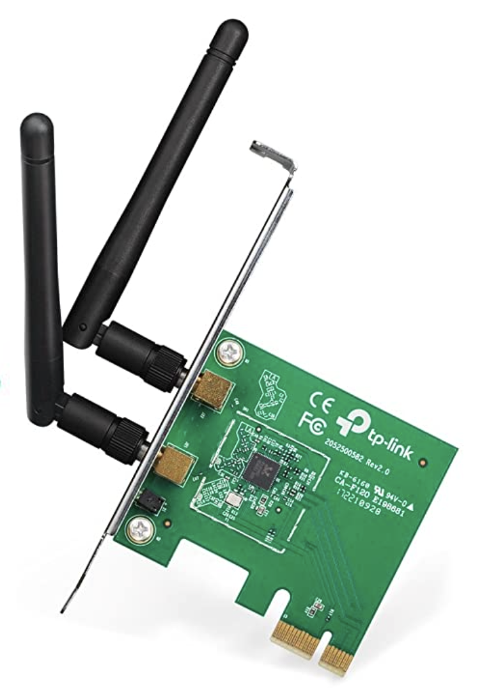
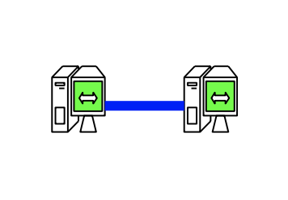
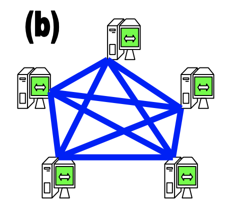
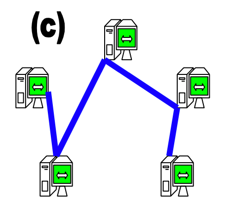
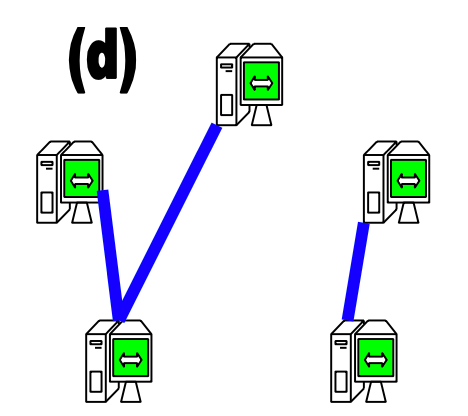
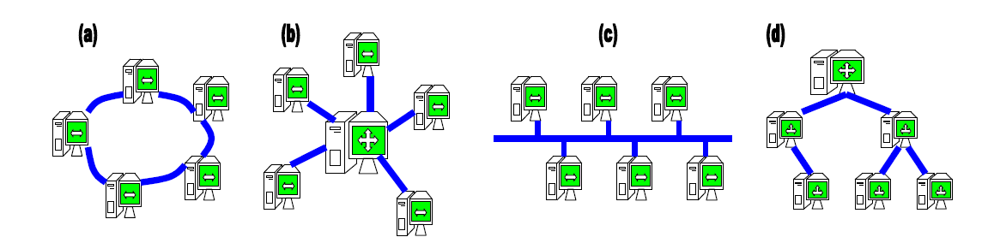
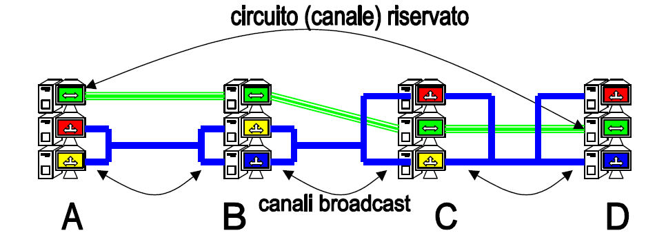

# Introduzione

# Che cos'è una rete di calcolatori

**Def**: una rete di calcolatori è un insieme di dispositivi di calcolo **autonomi** e **interconnessi**.

- Esempi

  Una rete telefonica NON è una rete di calcolatori:

  - I dispositivi sono interconnessi;
  - Ma **non** sono autonomi.

  Tanti computer nella stessa stanza NON fanno una rete di calcolatori:

  - Sono dispositivi autonomi;
  - Ma **non** sono interconnessi.

## Perché creare una rete di calcolatori?

- Le reti forniscono servizi utili agli umani, ad esempio:
  - E-mail;
  - WWW;
  - Internet of things;
  - ecc.
- Permettono ai calcolatori di comunicare fra loro:
  - Possono condividere risorse e informazioni (ad esempio posso condividere una stampante con tutti i calcolatori di un ufficio, senza bisogno di comprare tante stampanti);
  - Posso effettuare operazioni di calcolo distribuito (per quando la potenza di un singolo calcolatore non basta, [ad esempio per elaborare la foto di un buco nero](https://www.jpl.nasa.gov/edu/news/2019/4/19/how-scientists-captured-the-first-image-of-a-black-hole/));
  - Possono condividere supporti di memoria (il cloud).

# Classificazione delle reti

Le reti vengono classificate in base alla dimensione geografica:

PAN << LAN << MAN << WAN << Internet

- Personal Area Network (PAN)

  Connessione fra dispositivi in una stanza, ad esempio un computer ed una stampante.
  Queste reti sono gestite da chi le utilizza.

- Local Area Network (LAN)

  Connessione fra dispositivi in un edificio, ad esempio il wifi di casa.
  Queste reti sono usate anche per campus universitari o per le reti aziendali, sono mantenute dall'ente che le usa.

- Metropolitan Area Network (MAN)

  Reti urbane, ad esempio la rete almawifi a Bologna.
  Coprono aree del raggio di decine di chilometri, sono mantenute da provider di servizi di comunicazione e/o gestori telefonici.

- Wide Area Network (WAN)

  Reti nazionali e internazionali. Possono coprire distanza internazioni o planetarie, sono mantenute da vari enti multinazionali e gestori delle comunicazione. Sono reti complesse, formate da diverse tecnologie integrate fra loro (ad esempio fibra e satellite).

- Internet

  È la rete di reti, la rete globale. È formata dall'unione delle altre reti (ad esempio le WAN) che obbediscono tutte a protocolli comuni (ad esempio il protocollo email, oppure http, ecc).

# Evoluzione e costi

The year: **1969**. The location: **Los Angeles**.

Viene creata la prima rete di Internet da un esperimento universitario, vengono connessi 4 calcolatori di 4 università diverse.

Una trentina d'anni dopo, nel 2003, ad Internet erano connessi oltre 172 **milioni** di calcolatori.

Oggi (2021) ci sono oltre 30 **miliardi** di dispositivi connessi (tanto che sono finiti gli indirizzi IP, che sono 4 miliardi, e si è dovuto trovare un escamotage).

Il motivo di questa crescita esponenziale è che ormai i **calcolatori necessitano** di essere **interconnessi** tra loro più di quanto ne necessitano gli umani. La maggior parte di Internet è formata da una serie di **attività** e **servizi rivolti** alle **macchine** stesse e che hanno come effetto **indiretto** quello di fornire servizi agli **umani**.

## Costi

Inizialmente i costi erano coperti dai militari, in quanto solo loro avevano bisogno della rete. In seguito man mano che è cresciuta ci si è resi conto che servivano infrastrutture ad hoc (la rete telefonica non bastava più), quindi i costi sono stati coperti da consorzi internazionali, governi per la gestione su larga scala e una rete capillare di piccoli gestori locali per la piccola scala.

Gli utenti affittano l'accesso all'infrastruttura dai provider tramite contratti. All'inizio le tariffe erano a tempo, con l'aumentare della velocità delle connessioni si è passati ad un modello tariffario a consumo. Oggi le tariffe più diffuse sono quelle di tipo "tutto incluso".

# Prestazioni

Le prestazioni sono misurate in due modi:

- Capacità di trasmissione
  Misura il numero di bit o byte trasmessi in un secondo. Si parla di Kbyte, Mbyte, Gbyte, ecc.
- Ritardo del collegamento
  È il tempo impiegato dai dati per andare da mittente a destinatario. Dipende dalla distanza fisica e altri fattori, come le regole dei protocolli di comunicazione.

# Componenti

Una rete di calcolatori necessita, oltre che dei calcolatori di base, di certi componenti hardware e software.

## Parte hardware:

- Dispositivo o scheda di rete
  Permettono di codificare, trasmettere, ricevere e decodificare i dati fra calcolatore e rete

  

- Mezzo di trasmissione
  È il supporto che permette la propagazione dei dati: cavi, fibre, fili elettrici, lo spazio nel quale si propagano le onde radio). Sono ciò che compone l'infrastruttura fisica della rete.
- Connettore di rete
  È l'interfaccia tramite cui si connette il dispositivo alla rete, ad esempio un antenna per il wifi o un cavo ethernet.

## Parte software:

- Parti del Sistema Operativo
  Le schede di rete sono gestite direttamente dal SO tramite driver e devono rispettare una serie di protocolli per la gestione della comunicazione.
- Protocolli di rete
  Un insieme di regole per creare uno standard comune e garantire che tutti i calcolatori che si affacciano sulla rete possano comunicare fra loro.

# Collegamenti e infrastrutture di rete

Un collegamento di rete è reso possibile da un mezzo di trasmissione (ad es. un cavo) che sia condiviso da almeno due calcolatori.

Un'infrasruttura è l'insieme dei collegamenti fra tutti i calcolatori connessi ad una rete. Due calcolatori qualsiasi possono comunicare fra loro se esiste un cammino diretto o indiretto fra essi all'interno della rete. Vi sono diverse classi di strutture di connessione alla rete:

- **Punto a punto**: connessione diretta fra due soli dispositivi
  È il caso più semplice di infrastruttura ed è facile gestirlo.

  

- **Connessione multipla completamente connessa**: connessione diretta fra più di due dispositivi
  È una struttura molto ridondante, ogni dispositivo è connesso direttamente a tutti gli altri. Con l'aumentare del numero di dispositivi aumenta il casino da gestire.

  

- **Connessione multipla parzialmente connessa**
  Permette comunque la connessione fra tutti i dispositivi ma senza che ci sia un cammino diretto fra ogni calcolare. Il rischio è che in caso di un guasto alla rete si possa creare una partizione di reti (un insieme di componenti separato dal resto della rete).

  

- **Connessione multipla con partizione di rete**
  Due o più gruppi di reti sono isolati fra loro. Di solito la configurazione è dovuta a guasti sulla rete o da cattive applicazioni dei protocolli.

  

# Topologia di rete

Le infrastrutture di rete possono essere realizzate secondo vari schemi:

1. **Anello**: ogni elemento è connesso solo col precedente e col successivo
2. **Stella**: ogni elemento è connesso con un unico elemento centrale
3. **Bus**: ogni elemento è connesso al bus centrale condiviso
4. **Albero**: simile ad un albero genealogico

Come regola generale le reti più piccole adottano una delle topologie citate, mentre quelle più grandi ibridano più topologie per aumentare la ridondanza e rendere la rete meno esposta al rischio di partizionamento, in questo caso si parla di **topologia a maglia**.

# Il mezzo fisico di trasmissione

È il mezzo fisico con cui si realizza la comunicazione, che supporta la propagazione del segnale fra due diverse schede di rete. Può essere essenzialmente di 3 tipi:

- Cavo metallico (di solito rame)

  L'informazione viene trasmessa come segnale elettrico (ovvero come variazione di corrente all'interno del mezzo trasmissivo). È molto usato grazie alla sua affidabilità e al suo buon rapposto costo/prestazioni.

- Ethernet

  Più prestante del singolo cavo di rame, è formato da 4 fili di rame attorcigliati fra loro in un coating isolante, in questo modo permette la trasmissione di più informazioni a parità di tempo.

- Fibra ottica

  Fibre di vetro attraverso cui viaggia la luce, offre prestazioni altissime e necessita di meno amplificatori di segnale lungo la strada ma ha un costo molto elevato.

- Onda radio (wireless)

  Il mezzo di trasmissione in questo caso non esiste (è "l'etere"). Possono essere usate onde radio, o raggi infrarossi. Permettono grande flessibilità nello spostamento dei calcolatori, ma non sono molto affidabili e raggiungono velocità ridotte.

# Scheda di rete

La scheda di rete si occupa di interfacciare un calcolatore alla rete codificando, trasmettendo, ricevendo e decodificando le informazioni. Essa dipende dal mezzo di trasmissione usato ed è dotata di un proprio indirizzo MAC (Medium Access Control) univoco che identifica la scheda di rete nel mondo.

# Canale di comunicazione di rete

Un canale di comunicazione è una visione astratta del mezzo di trasmissione, ovvero è come scelgo di usare quel mezzo per trasmettere informazione. Ci sono fondalmentalmente due categorie di canali di comunicazione: canale punto a punto e canale broadcast.

Il canale **punto a punto** è un canale riservato fra due dispositivi in comunicazione; il vantaggio è che non c'è bisogno di includere mittente e destinatario, in quando la comunicazione è fra due soli calcolatori.

Steso un canale trasmissivo, possiamo fare più comunicazioni punto a punto in parallelo: un gruppo comunica sul canale A, uno sul B, ecc.

Gli svantaggi sono che bisogna riconfigurare la rete nel momento in cui si voglia parlare con qualcun altro e che il canale è riservato: se sta venendo usato non si può fare altro (ad es. quando ci si connetteva ad internet e non si poteva usare il telefono).

Un canale **broadcast** è un canale dove tutti i dispositivi trasmettono e ricevono (se mando un messaggio tutti lo ricevono). In questa configurazione è richiesto l'utilizzo di protocolli per evitare collisioni e perdita di messaggi. I vantaggi sono che con un solo canale possiamo mettere in comunicazione più calcolatori e che un dispositivo può comunicare con altri dispositivi della rete senza bisogno di riconfigurare quest'ultima.

# Reti a commutazione di circuito

L'idea è quella di comporre a cascata una serie di canali di comunicazione punto a punto in modo da poter mettere in comunicazione i due calcolatori agli estremi della rete.

Un esempio classico è la linea telefonica.

Nelle reti a commutazione di circuito il jitter è molto basso. Solitamente si paga per il tempo di utilizzo. Lo svantaggio è che viene riservato un canale intero per una comunicazione, quindi ogni momento in cui non si comunica è uno spreco di risorse del sistema.

# Reti a commutazione di pacchetto

A differenza delle a commutazione di circuito, questa è una metodologia molto usata nelle reti a canali broadcast. Dal momento che internet usa reti broadcast, tutta la comunicazione di internet avviene a pacchetto.

L'idea è di scomporre la comunicazione in più pacchetti sequenziali e ognuno diventa una trasmissione sulla rete. Ogni pacchetto viene spedito indipendentemente sul canale broadcast e dovrà includere l'indirizzo del destinatario e quello del mittente, oltre che la comunicazione vera e propria.

Pro:

- È richiesto un minor numero di risorse di rete;
- Questo minor numero di canali richiesto è anche usato meglio.

Contro:

- Ogni singolo pacchetto subirà una latenza di rete maggiore;
- Singoli pacchetti possono andare perduti o arrivare in ordine sparso.

Il vantaggio maggiore (per il marketing) è che si può far pagare l'utente per la quantità di dati consumati invece che a tempo.

Ulteriore vantaggio: nel momento in cui voglia comunicare con un altro dispositivo potrei farlo subito semplicemente indicando il suo indirizzo come destinatario, a differenza di quanto dovremmo fare con i canali punto a punto.

# Servizi orientati alla connessione e non

Dal momento che i singoli pacchetti possono percorrere strade diverse per arrivare al destinatario, non è detto che arrivino nello stesso ordine di invio o che qualche pacchetto non si perda per strada. Per questo entrano in gioco i servizi di trasmissione, che determinano le proprietà di mittente e destinatario in base ai protocolli usati.

I servizi di trasmissione possono essere orientati alla connessione (connection-oriented) oppure no (connectionless).

## Servizi orientati

Questi servizi garantiscono che la trasmissione sia affidabile e corretta: si assicurano che i pacchetti arrivino nel giusto ordine e, tramite un sistema di feedback dal dispositivo destinatario, rispediscono i pacchetti che non arrivano entro un certo intervallo di tempo.

Tali servizi sono implementati attraverso opportuni protocolli alternativi: ad esempio i pacchetti potrebbero essere numerati, oppure spediti attraverso un circuito virtuale riservato, o altre soluzioni ancora.

## Servizi non orientati

Non si preoccupano di garantire l'ordine corretto dei pacchetti e nemmeno la ricezione di tutti i pacchetti; si occupano solo di spedire i pacchetti che ricevono, sono molto simili alla spedizione di una sequenza di lettere tramite poste italiane.
