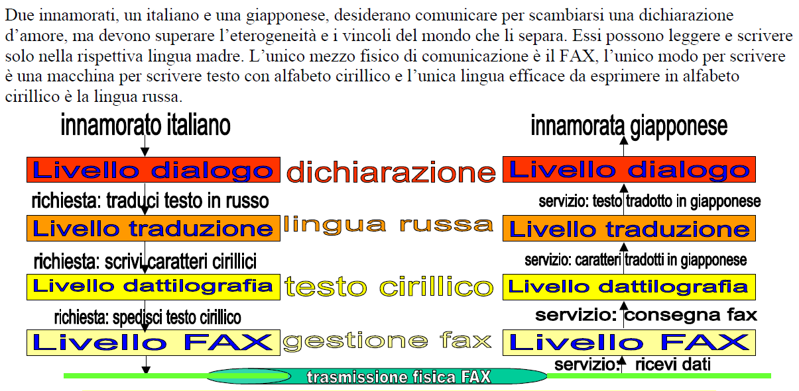
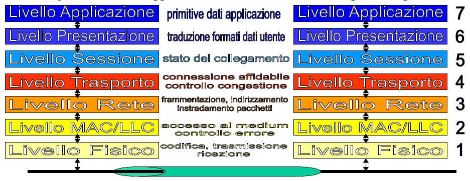
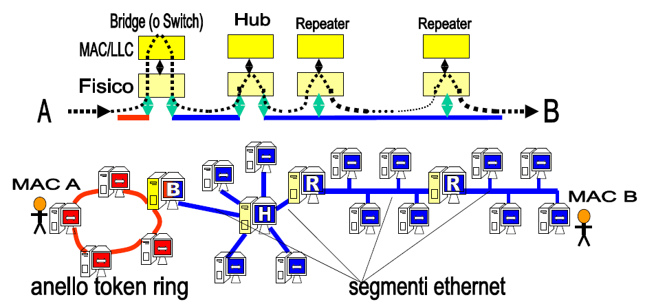

# Reti locali

# Protocolli di rete organizzati a livelli

Un protocollo è un insieme di regole di comportamento e procedure di gestione dei processi di comunicazione (semantica) e di regole di tipo sintattico, ovvero come devono essere strutturati i messaggi da scambiare.

Quindi in sostanza i protocolli stabiliscono cosa fare quando e cosa fare come, se si vuole comunicare nella rete.

Grazie ad essi è possibile la compatibilità di comunicazione fra i dispositivi che sono connessi alla rete, che sono eterogenei fra loro.

I protocolli solitamente hanno nome dello standard e nome commerciale:

- **802.11** è il nome standard, **Wifi** è il nome commerciale;
- **802.3** è il nome standard, **Ethernet** è il nome commerciale.

# Architettura di protocolli

Una Architettura dei protocolli di rete è un insieme di protocolli che funziona in maniera coordinata e sincrona, dal momento che un solo protocollo non basta per gestire una rete complessa come Internet.

I protocolli sono strutturati a livelli. La regola generale dice che, dato un livello x, esistono protocolli alternativi che possiamo interscambiare. I livelli superiori e inferiori possono interagire col livello x solo con le opportune API.

Dal momento che i protocolli possono cambiare e aggiornarsi (magari per sistemare falle, magari per introdurre migliorie) è necessario che, qualunque sia il loro funzionamento interno, si comportino sempre allo stesso modo quando ricevono input dai protocolli del livello sottostante e quando mandano output ai livelli sovrastanti.

Ed è qui che interviene l'architettura:

> Un'architettura di protocolli definisce il template sul quale vanno realizzati i protocolli di rete.

Alla fine è sempre solito principio di astrazione/implementazione alla base di tutta l'informatica.

## Esempio di architettura di protocolli

Vediamo un esempio di architettura di protocolli tramite il classico esempio dell'innamorato Italiano che vuole parlare alla sua innamorata Giapponese.

# Architettura standard di protocolli di rete

Lo standard di tutte le comunicazioni di rete è formato da 7 livelli ed è chiamato **Standard ISO/OSI RM** (Open System Interconnection Reference Model).

È un insieme di livelli _completo_ (non esiste un livello mancante) e _rigoroso_ (formalmente definito in quel modo e o lo rispetti o non lo rispetti, non ci sono vie di mezzo).

Ogni livello gestisce una classe di problematiche di rete mentre riceve una versione semplificata del resto della rete per cui tutte le problematiche degli altri livelli sono già state risolte.

Man mano che si sale nella rete si nota che dal punto di vista del livello più alto la rete è una scatola magica dove le cose semplicemente funzionano.

I 7 livelli sono (dal più alto al più basso):

- Livello Applicazione
- Livello Presentazione
- Livello Sessione
- Livello Trasporto
- Livello Rete
- Livello MAC/LLC
- Livello Fisico

Ecco una rappresentazione schematica dei livelli dell'architettura:

## Architettura dei protocolli di Internet

L'architettura dei livelli dei protocolli di Internet utilizza solo 5 dei 7 livelli menzionati precedentemente.

Ogni volta che un dato viene trasmesso, a partire dall'origine la trasmissione viene **incapsulata** in "buste" con dati aggiuntivi.

Al momento della ricezione poi ogni livello prende la busta, ne estrae il contenuto e lo passa al livello sovrastante (quindi è tipo una matrioska).

Nello specifico su internet i livelli usati sono:

- Livello applicazione: genera il dato da spedire;
- Livello Trasporto: imbusta i dati inserendo info sul modo di riordinare i pacchetti e controlla la velocità di invio delle buste;
- Livello Rete: spezza i dati in pacchetti e sceglie il cammino sul quale inviarli;
- Livello MAC/LLC: esegue la consegna finale dei dati alla rete locale;
- Livello Fisico: dove transitano i dati.

> I protocolli fanno il loro meglio ("best at all") ecco perché i provider nel proporre gli abbonamenti forniscono la velocità massima raggiungibile, ma nessuna garanzia sulla velocità minima, perché non è tecnicamente possibile garantire che la trasmissione vada a buon fine.

# Livelli e integrazione delle reti

Vediamo nel dettaglio i vari livelli di rete.

## Livello fisico

Il livello più basso è quello che si occupa fisicamente della trasmissione. I protocolli implementati a questo livello sono molto semplici e si riassumono in:

- Codifica e spedisce il pacchetto appena ricevuto dal livello MAC/LLC;
- Decodifica e manda al livello MAC/LLC il pacchetto appena ricevuto.

Questo livello trasforma i segnali digitali in analogici.

La velocità di una connessione non dipende dalla velocità con cui transitano i dati, siccome questa è sempre la stessa ed è la velocità della luce, ma dalla quantità di dati che posso mandare in un certo intervallo di tempo.

Più dati mando e più brevi saranno i segnali, rendendo quindi più difficile il compito di captarli e decodificarli, per questo per aumentare la "velocità" di una rete sono necessarie tecnologie più sofisticate, che siano in grado di captare e decodificare senza sbagliare un certo numero di bit per secondo.

## Livello MAC/LLC

Il livello più semplice di una rete a commutazione di pacchetto è il **segmento di rete locale**.

Esso è formato da un mezzo di trasmissione condiviso con un canale ad accesso multiplo ([ricordi i canali?](./appunti-andrea-bianchi-01-introduzione.md/#canale-di-comunicazione-di-rete)). Tutte le schede video connesse al segmento ricevono le trasmissioni effettuate e trasmettono a tutte le altre schede video.

Per riconoscere il destinatario di una trasmissione viene dato ad ogni scheda video un **indirizzo MAC**, che è unico ed è assegnato in fase di produzione, è come un'impronta digitale della scheda di rete.

Il Livello MAC/LLC si occupa di fornire l'accesso al mezzo trasmissivo (Livello Fisico), quindi si occupa di trasmettere i dati, di specificare a chi è destinata la trasmissione e di ricevere i dati destinati alla propria scheda video.

Tipicamente un Livello MAC/LLC si comporta così per trasmettere dati:

- Attendi che sia il tuo turno di comunicare;
  - Nel caso di una rete di topologia bus o star significa vedere se la rete è libera e, nel caso sia occupata, aspettare un tempo $t$ casuale prima di tentare di nuovo l'invio;
  - Nel caso di una rete token ring significa aspettare di avere il token;
- Spedisci il messaggio;
- Aspetta l'acknowledgement, se non arriva prova a rispedire il messaggio.

E viceversa quando li riceve:

- Controlla che il dato in transito abbia il mio indirizzo MAC;
- Se sì ricevi i dati e mandali ai livelli superiori;
- Manda indietro l'ack per i pacchetti arrivati.

Quando ricevo un pacchetto mando immediatamente l'acknowledgement.

Il protocollo infatti prevede che il mezzo trasmissivo sia da considerarsi occupato anche immediatamente dopo l'invio del pacchetto, in questo modo l'ack è protetto da collisioni.

### Come rendo il segmento affidabile?

Rendere il canale affidabile significa eliminare (o ridurre al minimo) gli errori di trasmissione dovuti a collisioni o interferenze.

Come abbiamo visto il protocollo MAC/LLC prevede l'invio di un acknoledgement per confermare l'avvenuta ricezione del frame; il mittente quindi dopo aver spedito i dati resta in attesa di questo ack e, se dopo un certo tempo di timeout non ha ricevuto nulla, rispedisce il frame incriminato.

Questo funzionamento è solido poiché:

- Non potrebbe funzionare il contrario: il destinatario non può mandare ack di pacchetti che non ha ricevuto perché non sa se deve effettivamente ricevere un pacchetto o no.
- Se anche l'ack si perde e non torna al mittente, worst case scenario il mittente rispedisce il frame e il destinatario lo scarta; si usa un po' di più la rete ma si mitiga il rischio di mancata consegna di frame.

Ovviamente questo comportamento si presta a diversi tipi di attacchi da parte di malintenzionati, ad esempio non mandare volutamente gli ack e costringere quindi il mittente a riempire la rete di frame e occuparla per tutti gli utenti connessi.

> **Denial of acknoledgement**: attacco hacker che consiste nel non mandare l'ack e porta il mittente a intasare la rete mandando infiniti pacchetti.

A livelli più alti questo protocollo non può garantire l'affidabilità, può solo farlo fra i nodi di un segmento locale. Se ad esempio lungo il cammino dovesse esserci un ostacolo alla trasmissione sarà il livello 3 a reindirizzare i dati seguendo un'altra strada.

### Tecnologie per schede di rete: 3 esempi

Come abbiamo detto l'architettura dei protocolli di rete è realizzata per permettere di usare un protocollo piuttosto che un altro senza che questo cambiamento vada a rompere il funzionamento dei livelli sotto e sovra stanti.

A titolo di esempio vediamo 3 protocolli diversi per il livello 2 (MAC/LLC) che possono essere usati su diverse schede di rete che si affacciano sullo stesso segmento locale:

- **Ethernet** (o IEEE 802.3):

  È lo standard delle reti cablate; la scheda di rete può ascoltare il canale e trasmettere se questo è libero, altrimenti sceglie un tempo random dopo il quale riprovare. L'ethernet è in grado di rilevare le collisioni e nel caso ritentare in seguito la trasmissione.

- **Wifi** (o IEEE 802.11):

  È lo standard delle reti senza fili. Anche in questo caso la scheda ascolta il canale e trasmette se lo trova libero. Non è però in grado di capire se ci sono state collisioni, quindi per ridurre il rischio che esse avvengano si dilazionano le trasmissioni nel tempo.

- **Token ring**:

  In realtà è ormai usata pochissimo, richiede che la rete sia a topologia ad anello. Ogni scheda di rete attende di ricevere il token e, una volta ricevutolo, può trasmettere entro un certo tempo $t$ prestabilito. È una rete che si presta molto ad attacchi (ad esempio distruggo il token, oppure genero token in più di tanto in tanto, ecc), quindi è usata solo in contesti chiusi in cui si sa di potersi fidare del buon rispetto delle regole dei calcolatori connessi; in compenso è molto efficiente e garantisce alte prestazioni.

## Comporre segmenti in reti locali

Il passaggio successivo è unire i vari segmenti di rete locale in una rete locale vera e propria (quindi una LAN).

Per comporre i vari livelli si procede sempre a livello Fisico (1) e livello MAC/LLC (2), nello specifico vengono usati:

- **Repeater**

  Ripetitori. I segnali trasmessi sul mezzo fisico degradano con la distanza, nella fattispecie l'ethernet degrada dopo circa 200 metri, quindi ogni 200 (o, meglio, 100) metri si aggiunge un ripetitore. Il ripetitore **amplifica** e **rigenera** il segnale ricevuto.
  Il repeater collega due segmenti di rete che hanno la stessa tecnologia MAC; non legge i dati, vede semplicemente che sta arrivando un segnale e lo amplifica e passa oltre.
  Con l'allungarsi delle distanze chiaramente le trasmissioni impiegano un po' di tempo in più per viaggiare da mittente e destinatario, quindi nel caso di reti LAN più grandi diventa necessario allungare i tempi di timeout.

- **Hub**

  È un repeater multiporta. È il nodo centrale di una rete a stella. Quando riceve un segnale da una porta lo copia e lo manda a tutti gli altri elementi della rete. È usato pochissimo in quanto costa poco meno dello switch, che però offre più funzionalità e porte.

- **Bridge**

  Funziona come uno switch (quindi lavora a livello 2) ma connette tecnologie a livello locale con MAC protocol **diversi** (ad es. Ethernet e Wifi). Se riceve trasmissioni da un protocollo (ad es. Ethernet) e deve mandarle ad un altro protocollo (ad es. Wifi) prende il pacchetto, lo smembra e lo ricostruisce in un frame compatibile con l'altro protocollo (i dati cambiano la "busta gialla").

- **Switch**

  Lavora a livello 2. A differenza del bridge permette di connettere molti più segmenti (oggi gli switch hanno anche 96 porte). Interconnette tecnologie **omogenee**, non diverse, e filtra i pacchetti da inoltrare a seconda della loro destinazione. Manda i dati in broadcast solo se non sa dov'è il destinatario. - **Buffered switch:** ha un buffer di memoria che ha la funzione di memorizzare tutti i frame che arrivano. Questo siccome la trasmissione deve essere smistata e non è automatica, ma segue le regole del protocollo MAC, può essere necessario che una trasmissione debba attendere il completamento di un'altra precedente.

## Esempio completo di rete locale

Un esempio di diversi segmenti di rete locale collegati attraverso Bridge, Hub e Repeater.

