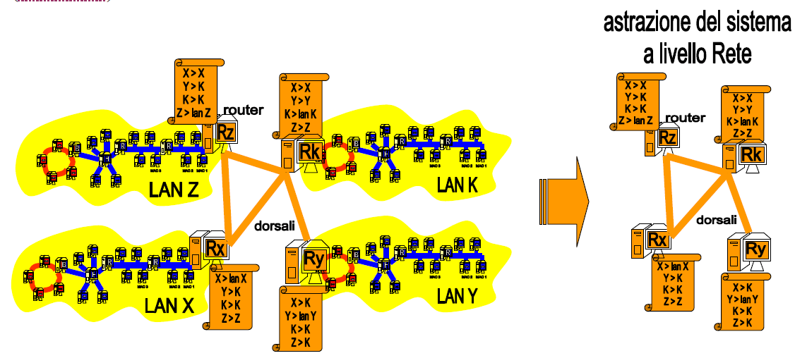
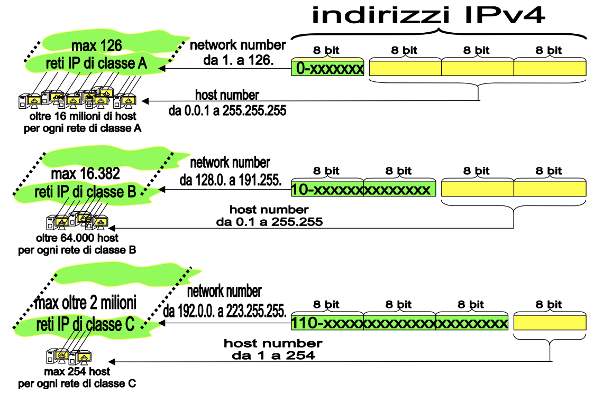

# Reti di reti

> Questo è un concetto **fondamentale** per tutto il corso, non avere chiaro questo livello significa non saper fare granché.

# Reti di reti e internet working

Nel momento in cui bisogna collegare fra loro più reti locali, i protocolli di Livello 1 e 2 diventano inefficaci, in quanto renderebbero la comunicazione complessa e soggetta a ritardi ed errori.

Si passa quindi alla necessità di costruire una gerarchia con cui organizzare le reti.

Al **Livello Rete** (3) appare la figura del **Router**, che funge da rappresentante della rete locale a lui associata (1 router = 1 rete locale). I router sono a loro volta collegati da linee dati veloci chiamate **dorsali**.

- Esempio di rete di reti locali
  

Il router controlla l'accesso alla rete locale:

- Smista i pacchetti che transitano per la rete:
  - Nel caso di un pacchetto nato nella rete e destinato alla rete stessa il router resta a guardare.
  - Nel caso di un pacchetto destinato all'esterno il router applica il protocollo di livello 3 e si interfaccia con le dorsali di collegamento.

Il protocollo di livello Rete (3) prevede che il router fornisca il frame di informazioni sugli **indirizzi IP**.

Questo perché il MAC non è un indirizzo dotato di struttura gerarchica, nello specifico le differenze fra MAC e IP sono:

- Il MAC è univoco e fisso per il dispositivo ma non ha una struttura gerarchica;
- L'IP ha una struttura gerarchica, è univoco ma non è esclusivo per il dispositivo: può cambiare (generalmente ogni giorno vengono riassegnati).

L'indirizzo IP ci fornisce **due** informazioni importanti:

1. Indica la rete di appartenenza del destinatario.
2. Indica, all'interno di questa rete, chi è il destinatario.

Può capitare che si formino pacchetti zombie, ovvero instradati male e che per questo finiscano in un loop senza destinatario finale; per rimediare il protocollo IP implementa un contatore che diminuisce ogni volta che il pacchetto viene trasmesso alla rete successiva, quando questo contatore raggiunge lo 0 il pacchetto viene **ucciso**.

# Livello rete: Internet protocol (IP)

Come abbiamo accennato, al livello di Rete (3) nasce il bisogno di un nuovo tipo di indirizzo, l'indirizzo IP (**Internet** **Protocol**, IPv4 o IPv6 che sia).

Questo indirizzo funziona per tutto internet ed è globale, strutturato e gerarchico:

- **Globale** perché non esiste rete connessa ad Internet che non abbia indirizzo IP;
- **Strutturato** perché è diviso in due parti, una per l'indirizzo della rete locale e l'altro per l'indirizzo della scheda di rete interna alla rete locale;
- **Gerarchico** perché appunto le due parti di indirizzo sono in ordine gerarchico (rete locale > scheda di rete).

L'indirizzamento IP è detto anche logico proprio poiché si tratta di un indirizzo virtuale che può essere riassegnato a piacere (a differenza del MAC che è fisico e proprio della scheda di rete).

Ogni volta che io mi sposto fisicamente (con uno smartphone o un portatile) in una nuova rete cambio indirizzo IP. Ciò pone un grande grattacapo a livello di rete, con gli indirizzi che cambiano continuamente diventa difficile capire dove spedire i pacchetti. Di queste problematiche si occupa il Router.

> La busta del pacchetto: il protocollo inserisce il frame in un ulteriore busta che contiene gli indirizzi IP di mittente e destinatario.

## Il Router

I router quindi sono dispositivi che lavorano a livello 3: nel momento in cui bisogna inviare e ricevere dati guardano solo la parte di IP che indirizza la rete, ignorando (momentaneamente) la parte che indirizza l'host, creando in questo modo una visione fortemente semplificata di Internet (come esemplificato nell'immagine).

- Astrazione della rete di reti a Livello 3.
  

### Protocollo di Instradamento e tabelle

Ogni router possiede una **tabella di instradamento**, ovvero una tabella che mappa la topologia della rete (almeno a una distanza di 1: conosco i miei host e il mio router superiore). I router sono dispositivi molto semplici, non possiedono quasi mai più di 4 uscite, di cui uno rivolta verso la rete interna. Di solito ogni router conosce solo un solo altro router, ovvero il suo router "padre", comunemente chiamato il **default gateway**.

Il **protocollo di instradamento** è quello che si occupa di aggiornare le tabelle di instradamento del router, questo è necessario poiché le "strade" di internet non sono immutabili ma cambiano spesso e per i più svariati motivi: guasto alla linea, congestionamento, ecc.

### Protocollo di routing

I cammini possibili per spedire un pacchetto sono diversi e trovare il più efficiente è compito dei **protocolli di routing**, che usando le tabelle cercano il cammino più breve e rapido possibile.

> **!** Protocollo di instradamento e protocollo di routing sono due cose diverse: il primo aggiorna le tabelle, il secondo usa le tabelle per scegliere la strada su cui mandare i dati.

### Frammentazione

Per rispettare i limiti imposti dalla rete (o dal mezzo fisico di trasmissione) e per ridurre il limite di errori il router si trova spesso a **frammentare** i dati da inviare: ad esempio devo spedire un pacchetto da 128kb ma la rete mi consente di mandare pacchetti di massimo 32kb, quindi il router mittente frammenta il pacchetto e lo spedisce in vari frame, viceversa il destinatario deve riunire il tutto.

Dal momento poi che tra l'invio di un frammento ed il successivo il protocollo di routing potrebbe trovare una strada diversa, può avvenire che i frammenti arrivino disordinati al destinatario (o che alcune parti non arrivino proprio).

> La comunicazione a livello rete è quindi di tipo **[connectionless](./appunti-andrea-bianchi-01-introduzione.md/#servizi-non-orientati)**: il destinatario forse riceve il pacchetto, se non lo riceve non è un problema del router, che si occupa solo di spedirlo (questa problematica si risolverà a livello 4).

# Indirizzamento IPv4

Come abbiamo detto, un indirizzo IP viene associato a una e una sola interfaccia (o scheda) di rete.

Se così non è ci saranno due destinatari per lo stesso pacchetto.

I router di questo se ne accorgono subito: due macchine con lo stesso IP stanno necessariamente nella stessa rete locale (perché la parte network è uguale), quindi il router della rete locale se ne accorge non appena riceve due ack per un pacchetto.

Non appena il router si accorge del problema lo risolve internamente alla rete, senza mai farlo notare all'esterno: solo lui saprà che c'è stato il problema e lo avrà risolto.

Una sola macchina però può avere più indirizzi IP, poiché potrebbe avere più schede di rete (quindi attenzione alla differenza in caso di domanda all’esame).

## Indirizzo IP Statico e Dinamico

L'indirizzo IP può essere statico: fisso un indirizzo IP ad un indirizzo MAC, così chiunque su internet sa che se vuole parlare alla mia macchina deve parlare a quell'indirizzo IP.

L'indirizzo IP dinamico invece cambia continuamente e quindi non mi rende sempre raggiungibile dall'esterno, rende più difficile essere sempre accessibile da internet.

## Com'è fatto un indirizzo IPv4

Un indirizzo IPv4 è composto da 32 bit o 4 byte.

Di solito è indicato con 4 valori decimali separati da punti, dove ogni valore va da 0 a 255.

---

Useremo continuamente l'aritmetica binaria per manipolare gli indirizzi IP e capire cosa sta succedendo, quindi conviene saperla a menadito.

[Ripasso di aritmetica binaria.pdf](../lucidi/03-ripasso-aritmetica-binaria.pdf)

---

Un indirizzo IP è sempre composto di due parti (vedi immagine nel paragrafo dopo):

- Il **Network Number** della rete rappresentata dal router.
- L'**Host Number** dell'interfaccia di rete dentro a quella rete.

## Classe di rete

Il valore dell'indirizzo IP determina la **classe della rete**. Le classi definiscono tipologie di reti logiche diverse.

- Classi di rete
  

### Rete di Classe A: **0**

Una rete di classe A è una rete in cui il bit più significativo vale 0, tradotto in decimale sono reti di classe A tutte le reti con indirizzo IP che va da `1.x.x.x` a `126.x.x.x`.

> L'indirizzo con tutti 0 e gli indirizzi con tutti 1 (dopo i bit che indicano la classe di rete) sono sempre riservati, quindi in ogni conteggio gli indirizzi disponibili sono 2 in meno di quelli fisicamente possibili.

> **!** L'indirizzo con nella parte host tutti i bit a 0 è usato per esprimere la rete su Internet, mentre quello con tutti i bit della parte host a 1 serve per indicare le trasmissioni broadcast per i pacchetti destinati a tutti gli host che appartengono a quella famiglia logica.

Quindi ci sono al massimo 126 reti di classe A in tutto internet: queste reti sono molto rare e sono utilizzate dai grandi provider di internet, poiché permettono di disporre di ben $2^{24}$ host diversi (16.777.216 di host). Si tratta quindi di reti dal potenziale enorme.

### Rete di Classe B: **10**

Se i primi due bit più significativi valgono 1 e 0 siamo in una rete di classe B. Sono reti di Classe B tutte quelle i cui indirizzi IP vanno da `128.0.x.x` a `191.255.x.x`.

Una rete di classe B è identificata dai primi due byte dell'indirizzo IP, quindi tolti i due bit fissi e gli indirizzi riservati, abbiamo un totale di 16.382 reti. Restano a disposizione due byte per indirizzare gli host, che saranno quindi più di 64.000.

### Rete di Classe C: **110**

Una rete di classe C ha i primi tre bit più significativi che valgono rispettivamente 1, 1 e 0. In decimale parliamo di tutti gli indirizzi da `192.0.0.x` a `223.255.255.x`.

Facendo sempre i soliti conti abbiamo che esistono $2^{21}$ reti di classe C (2.097.152 di reti), ognuna delle quali potrà disporre al più di 254 host (256 meno i soliti due riservati rispettivamente a indicare la rete e a indircare le comunicazioni broadcast).

# Subnetwork e netmask

È possibile creare sottoreti totalmente stagne all'interno di una stessa rete attraverso le maschere di rete.

L'idea è che posso rubare uno o più bit a partire dal più significativo della parte host dell'indirizzo IP per indirizzare una sottorete.

Se rubo un bit dalla parte host e lo "regalo" alla parte rete sto facendo subnetting. In base a quante sottoreti voglio creare scelgo il numero di bit da rubare: voglio creare due sottoreti? Mi basta rubare solo il primo bit, per crearne 3 posso rubare due bit e così via.

Per fare questa operazione si usa una **netmask** (maschera di rete), che appunto si occupa di "convertire" i bit della parte host.

La netmask spezza in due componenti logiche l'indirizzo IP:

- Indirizzo di subnetwork, che ha i bit uguali a 1 nella netmask;
- Host number dell'host appartenente alla sottorete: bit corrispondenti ai bit uguali a 0 nella netmask.

Con questi due componenti è possibile creare una gerarchia di sottoreti ciascuna amministrata dal suo **default** **router**. I default router fanno tutti capo al router che poi effettivamente rappresenta la rete su internet.

Quello che la netmask fa essenzialmente è dire quali sono i bit che compongono la parte rete e sottorete, questo è possibile perché il router utilizza l'indirizzo IP e la netmask per fare un & bit-a-bit al termine del quale l'indirizzo che ho ottenuto è quello della rete/sottorete, mentre la parte che ho azzerato poi la posso andare a riprendere ed è l'indirizzo host.

Di solito non si usa un intero byte per creare una sottorete poiché una volta raggiunto il numero massimo di host, eventuali altri host finiranno in altre sottoreti che non avevamo intenzione di creare. Si prendono solo i bit necessari a creare il numero di sottoreti che voglio.

Separare in sottoreti mi permette di impedire che i frame arrivino ovunque nella rete. Il paradosso è che possiamo virtualmente staccare degli host che sono fisicamente attaccati semplicemente cambiando gli indirizzi IP dei due host.

Al contrario del subnetting c'è il supernetting, ovvero raggruppare più reti in una più grande. Non è così semplice come il subnetting, vedremo meglio in futuro.

## Esercizi da esame

[Subnetting e netmask](https://www.notion.so/Subnetting-e-netmask-982f381f3d9f44c683350ff7cc29355d)

# Notazione CIDR - Classless Inter Domain Routing

È un'alternativa per riferirsi in maniera semplice alle maschere di rete quando si parla fra colleghi.

Prendiamo una rete di classe C, ad esempio 193.48.32.x, impostiamo una netmask che divide la rete in due: `255.255.255.128`, questa netmask la possiamo indicare con la notazione `/25`, che è un modo compatto di dire che impostiamo a 1 i primi 25 bit della netmask.

Questa notazione funziona solo tra "umani", nelle macchine dobbiamo comunque usare la notazione decimale.
