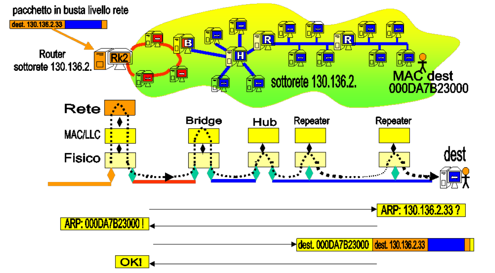
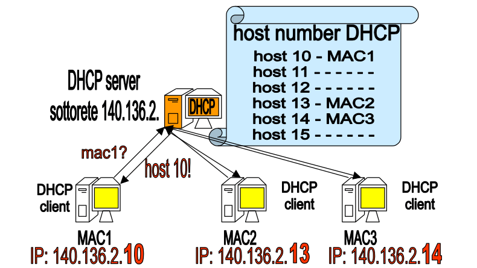
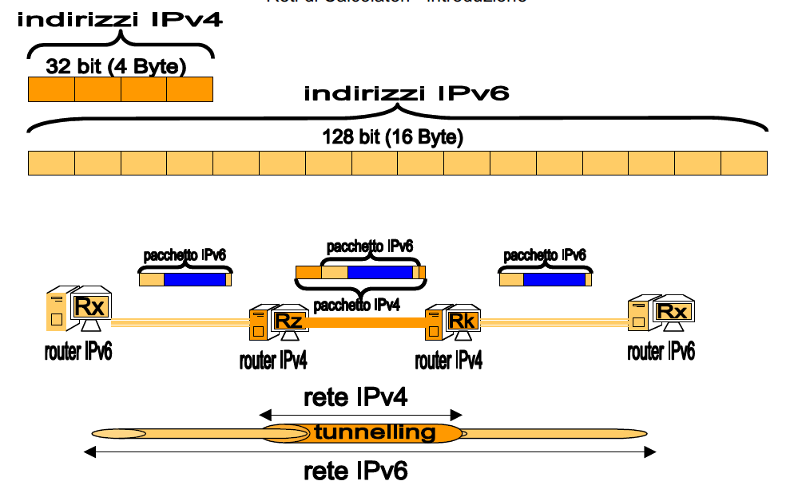

# Routing, ICMP, ARP, DHCP, IPv6

# Forwarding

Il forwarding è il processo di instradamento dei pacchetti dal mittente verso la destinazione.

Lo abbiamo affrontato tramite un esempio:

[Forwarding dei pacchetti](https://www.notion.so/Forwarding-dei-pacchetti-f4f175479b1e444b9fd866c343b8d655)

# Routing

Il problema del routing altro non è che il problema di dover aggiornare le tabelle di instradamento dei pacchetti.

Gli algoritmi di routing provano a fare un'istantanea della rete (anche se è impossibile avere un'immagine completa, è troppo dinamica) e a delineare la tendenza della rete in quel momento, così da poter costruire delle mappe stradali più efficaci possibili (l'obiettivo è sempre trasportare tanti dati, nel minor tempo possibile e con il maggior success rate possibile).

Ci sono due motivi per cui i collegamenti fra le reti di internet possono cambiare:

- Si trova una strada più rapida, oppure si congestiona una strada o cade la linea, quindi delle modifiche fisiche sulla rete;
- Cambiano gli accordi e le politiche economiche tra i provider di grandi porzioni della rete (AS, i Sistemi Autonomi, grosse collezioni di reti soggette ad una politica di amministrazione comune).

La seconda tipologia di cambiamenti porta a modifiche più lente, al più la rete viene aggiornata ogni ora, mentre le modifiche del primo tipo cambiano la rete ogni frazione di secondo.

Questo continuo cambiamento della rete è anche il motivo per cui i pacchetti non percorrono tutti la stessa strada e possono arrivare in disordine.

## Algoritmi di Routing

Gli algoritmi di routing adottano una serie di protocolli in modo da poter avere una sintomatologia della rete in quel momento.

Una prima stima la fanno già nel momento in cui inviano i pacchetti e aspettano gli Acknowledgements: se questi non arrivano probabilmente la strada è interrotta.

A questi si aggiungono i protocolli appositi per assistere i router nel lavoro da fare. Gli algoritmi devono essere il più semplici possibile, non ha senso usare algoritmi complessi ed esosi di risorse per aggiornare le tabelle di instradamento di una rete modesta, mentre non bastano algoritmi leggeri per aggiornare le tabelle di grandi reti nazionali.

La soluzione quindi è che sono anche essi gerarchici: a livello locale usiamo algoritmi statici (praticamente dei non algoritmi, dato che se la rete è statica quelle poche volte che cambia possiamo aggiornare le tabelle a mano), poi salendo fino a livello ad esempio della rete GARR si usano algoritmi come BGP (Border Gateway Protocol), RIP (Routing Information Protocol) o OSPF (Open Shortest Path First).

---

## Rete GARR

Piccolo interludio più a scopo informativo sulla rete GARR.

È la rete che dà i servizi web all'intero Ateneo e a tutti gli enti di ricerca italiani.

[Consortium GARR](https://www.garr.it/it/infrastrutture/rete-nazionale)

Qui si può vedere una mappa della rete GARR, è un ottimo esempio di una grande rete nazionale.

[GINS Weathermaps](https://gins.garr.it/xhome_weathermaps.php)

Dalla weathermap si può vedere in tempo reale lo stato di utilizzo delle reti connesse alla rete GARR.

> _"I router sono macchine spettacolari: immaginate un rack di server che trita pacchetti in entrata e uscita. Un rack di server, di calcolatori single-purpose."_

---

# Protocollo ICMP

L'Internet Control Message Protocol è quel protocollo che gestisce i messaggi di controllo su Internet. Si tratta in poche parole di uno standard per codificare le informazioni necessarie alla gestione di Internet stesso. Viene utilizzato continuamente da host, router e gateway per scambiare informazioni di livello rete.

I messaggi del protocollo ICMP viaggiano dentro le "buste arancioni" del protocollo IP, quindi a livello 3 (ICMP non arriva mai al livello 4).

Il protocollo scambia informazioni tramite codici messaggio; ad esempio il codice 000 corrisponde ad una _echo reply_, mentre il codice 008 corrisponde ad una _echo request_ (e si aspetta una reply in cambio). Di seguito alcuni tipi di messaggi che ICMP può scambiare:

- Rete di destinazione non raggiungibile (possibile interruzione di rete?);
- Rete di destinazione sconosciuta (abbiamo sbagliato l'indirizzo?);
- Host destinazione non raggiungibile (host spento o scollegato?);
- Host destinazione sconosciuto (abbiamo sbagliato indirizzo?);
- Protocollo richiesto non disponibile;
- Ricerca di un cammino alternativo per la destinazioni (se esiste).

Ogni messaggio ICMP ha un campo type e uno code, la coppia dei due determina il contenuto del messaggio.

Un ulteriore campo contenuto in un messaggio ICMP è il campo TTL (Time To Live): ovvero il counter che decidere se uccidere il pacchetto perché sta rimbalzando troppo nella rete. Il router che uccide il pacchetto recupera l'indirizzo IP del mittente e gli manda un messaggio ICMP per avvisarlo dell'uccisione del pacchetto, in modo che se il mittente lo desidera può ritentare la trasmissione impostando un TTL più grande o cambiando instradamento.

Vediamo ora due applicativi che fanno uso del protocollo ICMP.

## Ping

Serve per verificare la connessione fra due host.

Nel fare un ping da un host-1 ad un host-2 ciò che accade è che l'host-1 manda una echo request a host-2 e questo risponde con un echo reply. Nel fare ciò viene calcolato anche il tempo di andata e ritorno delle richieste (RTT - Round Trip Time).

```bash
ping csgw-3-0-5.cs.unibo.it
```

Ping ci fornisce anche il valore TTL impostato, in questo modo capiamo che ci sono stati al più x router sul percorso, altrimenti il pacchetto sarebbe morto prima.

Al programma Ping posso passare sia un indirizzo IP che un nome logico. Nel secondo caso Ping recupera da solo l'indirizzo IP necessario facendo una richiesta al server DNS.

## Traceroute

Nel cmd di windows si chiama tracert, nel terminale Unix traceroute.

```bash
traceroute csgw-3-0-5.cs.unibo.it
```

L'applicativo Traceroute serve per tracciare la strada che percorre il nostro pacchetto per arrivare da noi all'host destinazione.

Per fare ciò Traceroute emette dei Ping in cui il valore di TTL è impostato a 1 e incrementato sequenzialmente. Così facendo il pacchetto viene ucciso ad ogni passo ed ogni volta viene mandato un messaggio ICMP all'applicazione. Il messaggio ICMP contiene anche l'indirizzo del router che lo ha mandato e quindi così facendo Traceroute traccia tutti i router sul cammino.

# Protocollo ARP e RARP

La ARP table è quella tabella che associa ad ogni indirizzo IP connesso alla rete il relativo indirizzo MAC della scheda di rete connessa. Questa serve per poter inviare correttamente i pacchetti, dal momento che devo specificare entrambi gli indirizzi.

Anche il protocollo ARP può essere utilizzato tramite un applicativo da riga di comando omonimo.

La principale funzione del protocollo ARP è di dire alla scheda di rete che lo ha invocato quale sia l'indirizzo MAC di un determinato indirizzo IP.

A grandi linee ARP funziona così:

- Il router genera un frame con la richiesta ARP (se sei il calcolatore con IP x, rispondi col tuo MAC) e la manda in broadcast sulla rete locale;
- Il calcolatore interessato, se esiste ed è connesso, manda un frame di risposta al router nel quale specifica il MAC richiesto.

Il protocollo RARP è il contrario (infatti sta per Reverse-ARP): dato un indirizzo MAC conosciuto, richiedo l'indirizzo IP associato.



> 💡 Sperimentando in classe abbiamo scoperto un trucco interessante: facendo un **ping** (con l'omonima applicazione) all'indirizzo di **broadcast** ricevo in risposta la ARP table di tutte le macchine attualmente connesse. Quindi con ping posso fare un'istantanea della rete.

# Protocollo DHCP

È il protocollo che si occupa di assegnare un indirizzo IP ad ogni nuova macchina che si connette alla rete. Come per i precedenti protocolli, DHCP è anche un'applicazione che incarna le funzioni di questo protocollo.

La parte applicazione si concretizza in un server DHCP, che si occupa dell'assegnaziojne degli indirizzi IP, e in un client, ovvero colui che richiede al server di avere un IP.

Può capitare che il router faccia anche da DHCP server, non sempre ma può accadere.

In genere i numeri di rete (classe A, B e C) sono assegnati da grandi enti internazionali (come RIPE, ICANN, ARIN, APNIC).

I numeri di host possono invece essere assegnati manualmente (dall'amministratore di rete) oppure automaticamente da parte del server DHCP.



# Indirizzamento IPv6

Nel 1990 furono avviati i lavori per la definizione e l'implementazione del protocollo IPv6; questo poiché si prevedeva che IPv4 avrebbe finito gli indirizzi tra 2008 e 2018 (4 miliardi di indirizzi a disposizione). La previsione fu azzeccata: gli indirizzi IPv4 sono effettivamente finiti nel 2018, questo grazie anche al fatto che negli anni precedenti si era iniziato ad usare in modo ibrido IPv6 e IPv4.

Il grande problema che si è dovuto affrontare nell'implementare IPv6 è stato che bisognava che il nuovo protocollo rispettasse le regole dello stack (dell'architettura di protocolli).

## Caratteristiche salienti

Gli indirizzi IPv6 sono formati da 16 byte, il che porta il totale di indirizzi disponibili a $2^{128}=3,4\times10^{38}$ (qualcosa come miliardi di miliardi di miliardi di miliardi), in questo modo ci si è tenuti abbastanza larghi per essere sicuri di non dover ricambiare il protocollo in futuro (ci sono circa 15.000 indirizzi per ogni metro quadro della superficie terrestre).

Anche in IPv6 abbiamo il concetto di rete e sottorete e di host:

- Per la parte rete abbiamo a disposizione i primi 64 bit;
- I 64 bit meno significativi sono l'host number: $2^{64}$ host dentro ogni rete e sottorete, sono tantissimi (18 miliardi di miliardi, ogni rete può avere un numero infinitamente maggiore a quello di una vecchia classe A).

### Host numbers

Anche in IPv6 vale il discorso che il router può assegnare a piacere un numero di host ai dispositivi connessi alla propria rete, a patto che questo numero non sia già stato usato per un altro host.

Dal momento che per il numero di host abbiamo a disposizione ben 64 bit e un MAC address è composto da 48 bit, si è deciso che il router assegnerà sempre come numero di host il MAC address dell'host stesso. In questo modo siamo sicuri non solo che il numero di host sia unico all'interno della rete, ma che sarà unico in tutta internet.

Inoltre in questo modo si semplifica anche il protocollo DHCP, dato che so già che il mio host number è uguale al mio MAC address e quindi ci saranno meno scambi di informazioni.

### Nuova struttura del pacchetto

Dal momento che gli indirizzi IPv6 hanno una forma e caratteristiche diverse da quelli IPv4, bisogna che cambi anche la struttura dei pacchetti inviati tramite questo protocollo.

Innanzitutto cambia l'header del pacchetto, in modo da poter ospitare i 16 byte dell'indirizzo anziché i 4 byte di IPv4.

Inoltre nel protocollo IPv4 era previsto un campo, il ToS, che poteva essere utilizzato per garantire priorità ai pacchetti che la richiedevano. Il router avrebbe dovuto analizzare il campo ToS di tutti i pacchetti in entrata e poi li avrebbe smistati in uscita in base alla priorità richiesta dal pacchetto.

Questa funzionalità non è mai stata utilizzata poiché appesantiva di molto il carico di lavoro dei router, rallentando la connessione e annullando i vantaggi che avrebbe dovuto portare. Il capo ToS è quindi rimasto inutilizzato.

Con la definizione del protocollo IPv6 si è provato a reintrodurre questo sistema di priorità. Per ovviare alle problematiche di lentezza si è stabilito che non saranno più i singoli pacchetti ad avere o meno una determinata priorità, ma l'avranno sequenze di pacchetti intere.

Così i router si trovano a gestire per priorità dei flussi di pacchetti e non diventano troppo lenti. Best of both world I guess.

### Frammentazione

In IPv4 il protocollo si occupava di dividere i pacchetti ricevuti dal livello trasporto in tranci compatibili con la dimensione richiesta per l'invio, operando quindi una frammentazione dei pacchetti.

In IPv6 questa pratica è stata eliminata, o meglio è stata spostata al livello trasporto, in modo che il livello rete riceva i pacchetti già delle dimensioni giuste e si occupi solo di spedire i pacchetti al livello di sotto.

## Anatomia di un indirizzo IPv6

La rappresentazione binaria di un indirizzo IPv6 non è molto dissimile da quella di un indirizzo IPv4, si tratta di 16 byte invece che di 4.

La rappresentazione "human-readable" però è abbastanza diversa:

- I byte sono scritti non più in decimale ma in esadecimale, due cifre hex rappresentano un byte;
- Non ci sono più i `.` a fare da separatori ma i `:` ;
- Ogni gruppo dell'indirizzo rappresenta non uno ma 2 byte;
- In totale ci sono 8 gruppi separati dai `:`, che infatti sono 16 byte;
- I gruppi in cui tutte le 4 cifre valgono 0 possono essere omessi.

Esempio di indirizzo IPv6 (esteso): `BC12:FD00:3813:0000:0000:1111:2222:3333`.

Versione abbreviata: `BC12:FD00:3813:::1111:2222:3333`.

## Tunneling IPv4

L'ultima grande problematica che si è dovuta affrontare è stata il dover decidere come passare dal protocollo IPv4 all'IPv6.

Una volta messo appunto il protocollo IPv6 è impensabile eseguire un semplice switch-off (ovvero in un dato momento si smette di usare in toto il procotollo v4 e si inizia ad usare solo il v6), poiché non tutti i router, non tutte le schede di rete, non tutti i calcolatori sono in grado di gestire il nuovo protocollo. Uno switch-off del genere richiederebbe anni se non decenni di preparazione e ciononostante potrebbero comunque verificarsi bug e malfunzionamenti che si protrarrebbero nella rete per altri anni ancora.

L'unica strada percorribile è quindi quella di una lenta sostituzione del protocollo IPv4: si crea pian piano una sorta di Internet parallela che funziona con IPv6 e la si integra all'internet che gira su IPv4. Le schede di rete più moderne riconoscono entrambi i protocolli ed in base allo stack che devono utilizzare si comporteranno di conseguenza.

Rimane solo da gestire il caso in cui ci siano tragitti sulla rete (o intere backbone) che ancora non sono in grado di gestire il protocollo IPv6. In questi casi i router agli estremi di questi percorsi opereranno il tunneling, ovvero incapsuleranno il pacchetto IPv6 dentro una busta IPv4 e la spediranno lungo la backbone, per poi estrarre il pacchetto non appena questo esce dal tunnel creato.


