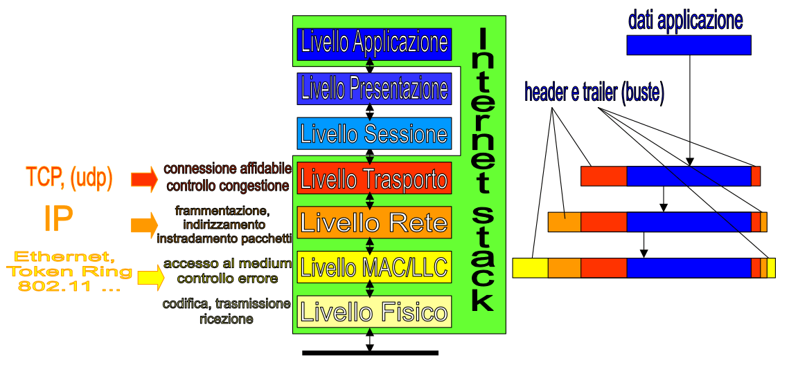

# Livello Trasporto

# Introduzione

Lasciamo ora il livello rete e passiamo al quarto livello dello stack: il livello trasporto.

Questo livello ha due compiti principali:

- Rendere la comunicazione di rete - _che è connectionless_ - affidabile end-to-end.
  I router sono dei dispositivi che lavorano a livello 3, questo vuol dire che loro mandano avanti i pacchetti, come dei passamano, non gli importa cosa succede ai pacchetti: se non arrivano, se il buffer si riempie e fanno cadere i pacchetti in eccesso. Sono tutti problemi che per i router non sono importanti, semplicemente loro vanno avanti a spedire i pacchetti successivi.
  Quindi il primo compito del livello trasporto è assicurarsi che i pacchetti dispersi vengano reinviati, in modo da rendere la connessione affidabile.
- Gestire la congestione.
  Immaginiamo questa situazione: un router riceve 300Gb di dati al secondo e ha un buffer di 300Gb, però riesce a elaborare e spedire solo 10Gb al secondo. Ne consegue che il primo secondo restano da gestire 290Gb, ma il secondo subito dopo arrivano altri dati che superano la capacità del buffer, quindi il router li lascia cadere. I router che hanno inviato quei pacchetti non riceveranno l'ack e quindi ripeteranno il processo; ben presto non solo il router centrale sarà congestionato, la congestione si espanderà a macchia d'olio verso tutti gli altri router.
  Quello che fa il livello trasporto è regolare in maniera rapida e responsive la pressione sui router: non appena ci si rende conto che la rete inizia a congestionarsi bisogna subito mettere in pratica dei sistemi appositi per decongestionarla immediatamente.

I protagonisti della suite di protocolli del livello trasporto sono TCP e UDP.

## Ruolo del livello trasporto

> I pacchetti a livello trasporto si chiamano **segmenti**.

Quando il destinatario finale riceve i segmenti provvede a fare il riordino, che è solo prerogativa sua, non di chi trasmette i dati (i router leggono solo la busta pacchetto, non quella segmento).

Il livello trasporto riguarda solo il mittente originale e il destinatario finale. Non riguarda i router nel mezzo, in questo modo la backbone di internet non viene appesantita e si mantiene la scalabilità.

Il destinatario finale deve crearsi un buffer in cui salvare i _pacchetti_ e una volta ricostruito il _segmento_ originale (cioè ha messo tutto in ordine) può passarlo al livello di sopra.

## Socket

I socket sono gli end-point di un canale di comunicazione a due vie. Essi sono identificati dall'indirizzo IP e dalla porta usata, dato che ogni porta corrisponde ad una applicazione sul dispositivo che sta comunicando.

I protocolli che gestiscono i socket sono due: TCP e UDP.

# Protocollo TCP

TCP (Transmission Control Protocol) è il protocollo di livello trasporto usato de-facto su internet.
Lo standard dell'architettura ne prevede l'utilizzo in connubio con il protocollo IP, per questo si parla più propriamente di TCP/IP.

Il protocollo TCP prevede che prima di iniziare uno scambio dati, la connessione vada attivata.
Il server TCP si mette in ascolto sulle porte delle applicazioni che gestisce, a quel punto se un computer vuole avviare una comunicazione inizia quella che è chiamata la **three-way-handshake**, a seguito della quale inizia la comunicazione vera e propria che poi verra chiusa al termine (quando il client ha ottenuto quello che voleva o quando il server manda in timeout il client).

## La three-way-handshake

Come abbiamo detto TCP richiede che la connessione venga attivata prima di iniziare lo scambio di dati. Questa attivazione viene fatta tramite la three-way-handshake, che come il nome suggerisce consta di 3 passaggi:

- Il client richiede la connessione al server sul socket opportuno;
- Il server (se è disponibile) risponde con un ack OK;
- A questo punto il client manda un terzo messaggio con i parametri necessari per inizializzare lo scambio dati.

Questi passaggi servono a rendere la connessione affidabile, scalabile ed efficiente.

Un possibile vettore di attacco può essere il mandare la richiesta di apertura di connessione e, dopo aver ricevuto l'ack, non mandare il terzo messaggio e lasciare il server in attesa (e quindi occupato). Per prevenire questo tipo di attacchi sono stati implementati i timeout, in modo che il server chiuda la connessione dopo troppo tempo in cui non ha ricevuto nulla.

TCP richiede anche una procedura per chiudere in maniera corretta la connessione: questo procedimento serve alle due parti per accordarsi sul fatto di non avere più nulla da dirsi e quindi di poter buttare giù la connessione di comune accordo.
È uno scambio necessario poiché il server quando apre la connessione alloca un buffer per la comunicazione con il client, buffer che viene rilasciato per altre connessioni solo al termine della comunicazione corrente.

## Controllo di flusso e congestione della rete

I pacchetti sono grandi pochi kilobit, se ne mandassi uno alla volta userei solo una frazione della rete (se ad esempio avessi una 100 mega, userei pochissimo), quindi bisogna trovare un modo di inviare più pacchetti insieme senza però congestionare i router.

Il problema sta nel capire quali pezzi del segmento ci siamo persi e richiedere il reinvio di quelli soltanto. In pratica dobbiamo trovare un modo per far conoscere al destinatario un'informazione che ha solo il mittente.

È matematicamente impossibile avere la certezza di riuscirci, ma dobbiamo avere fiducia che prima o poi ci riusciamo. Ci basta una certezza che la rete funzioni il 99,9% delle volte e lo faccia nei tempi previsti.

Non posso sapere se il mio pacchetto farà o meno saltare un router sopraffatto dal lavoro, quindi non mi resta che mandare il mio pacchetto sperando che i router nel mezzo reggano. E come me fanno tutti i mittenti sulla rete.

Esiste però una strategia da adottare per evitare che un congestionamento si propaghi a macchia d'olio.
Per sapere i miei limiti inizio inviando con un pacchetto, se torna l'ack posso provare a mandarne due, se tornano gli ack provo a mandarne 4 e così via, in questo modo sto testando la rete come fosse una scatola nera. Questo meccanismo è detto di **sliding window**, poiché rappresenta appunto la finestra di pacchetti che posso inviare.

Lo stesso fanno tutti gli altri utenti connessi. I router ricevono sempre più pacchetti e a un certo punto saltano e fanno il drop.
Se ad un certo punto non mi torna l'ack di un segmento potrebbe essere un sintomo di riempimento della rete, se rispedisco il pacchetto e arriva l'ack allora era solo un problemino incidentale e nulla più, ma se inizia a perderne di più è un sintomo grave e vuol dire che il buffer di un router nel mezzo si sta congestionando, quindi bisogna rallentare con l'invio di dati.

Il rallentamento non è graduale: si decelera con **stop-and-wait**: si riparte da un pacchetto e si procede col probing: mando un pacchetto e vedo se il router ce la fa. Questo decadimento serve perché se il pacchetto è droppato vuol dire che i buffer dei router sono pieni, quindi la cosa più furba è ripartire da 1, dando così modo al router di smaltire il carico, e ricominciare il gioco.

La fase in cui raddoppio i pacchetti ogni volta si chiama **slow start**; Una volta che arrivo al punto in cui la scorsa volta si congestionò il router, non raddoppio più l'invio di pacchetti e mando solo un pacchetto in più per volta, questo comportamento si chiama **congestion avoidance**.

Nel caso di una connessione TCP il meccanismo di avvio di una conversazione contiene anche le informazioni su quanti pacchetti riesce a gestire il server, in modo che quando con il slow start arriviamo a quel numero, smettiamo di incrementare il numero di pacchetti inviati.

Ci sono anche casi in cui il protocollo fa affidamente all'utente come fosse parte dell'architettura: il protocollo UDP prevede che l'utente rimandi o rinunci a stabilire una connessione se questa non risponde o risponde lentamente (quindi se la rete è congestionata). Alcune applicazioni quindi possono essere basate su protocolli connectionless.

Se oggigiorno internet funziona molto bene è perché troviamo sempre strade spianate, non congestionate.
Questo vuol dire che abbiamo un'infrastruttura capace di reggere tutto questo traffico senza entrare in congestione.

# Protocollo UDP

Il protocollo UDP (User Datagram Protocol) è molto meno usato del TCP poiché è un protocollo di tipo connectionless, infatti UDP non necessita di protocolli di apertura e chiusura della connessione (niente three-way-handshake, se il client vuole comunicare con il server lo fa e basta) e non dispone di meccanismi per assicurarsi che tutti i segmenti siano arrivati a destinazione.

UDP viene usato in pochi casi, ad esempio come smistatore di un server: posso usare un socket con il protocollo UDP che riceve tutte le richieste del server e in base alle richieste e alle risorse disponibili indirizza i client verso altri socket che saranno invece gestiti con modalità TCP.

# Nomi di dominio e servizio DNS

Gli utenti preferiscono navigare su internet tramite nomi di domini, ad esempio nomi di host come cs.unibo.it. Questi nomi hanno quindi lo stesso funzionamento degli indirizzi IP, difatti vengono assegnati da enti internazionali per evitare che possano esistere due nomi uguali per risorse diverse. ai router servono gli indirizzi IP.
Questi indirizzi fanno comodo ma non sono parte dell'architettura di rete, che prevedere l'uso di indirizzi IP.

Il DNS è un servizio che risolve questo problema, esso prende in input un nome di dominio human-friendly e restituisce l'indirizzo IP corretto.

## Organizzazione dei server DNS

Il servizio DNS è formato da una catena di server organizzati gerarchicamente.

Ogni router deve far riferimento ad almeno un server DNS, e ogni server DNS conosce almeno un DNS suo superiore nella gerarchia fino a quando si raggiunge la radice.

I server ricevono richieste tramite un protocollo che si chiama anch'esso DNS (quindi DNS indica sia il protocollo sia il server che realizza tale protocollo).

Un server DNS non è tenuto a conoscere tutti gli indirizzi di internet, quindi il protocollo prevede che il DNS locale, nel momento in cui non conosca l'indirizzo IP della risorsa richiesta, restituisca l'indirizzo del suo superiore a cui poter inoltrare la richiesta e così via finché non si trova il server che conosce l'indirizzo IP richiesto.

Un meccanismo migliore è quello del _DNS ricorsivo_: se il mio server DNS locale non conosce la risposta è lui stesso che chiede al suo superiore e così via finché la risposta non torna all'host che aveva fatto la domanda.

DNS è un servizio che si basa su UDP, quindi è una richiesta oneshot: se si congestiona il server la richiesta cade. Per questo motivo il funzionamento del protocollo lato host è abbastanza basilare: il client manda una richiesta una volta sola e se non riceve risposta dopo un po' di tempo di downtime ripete la richiesta. La risposta funziona anche come ack, perché non ha senso mandare sia l'ack che l'indirizzo richiesto.

Il meccanismo iterativo previene il congestionamento dei server, che se sono sopraffatti di lavoro dicono al client di mandare la richiesta ad un altro server DNS, liberandosi così di lavoro quando sarebbero sul punto di bloccarsi.

### Welcoming server

Il welcoming server sovrintende ad un rack di server DNS; il suo compito è controllare quanto sono carichi i server sotto di lui e inoltrare la richiesta a quello meno carico, in modo da distribuire il carico e evitare collassi.

Il welcoming server smista le richieste in arrivo ma non gestisce la risposta.

### DNS root

I DNS root server (radice del mondo) conoscono gli indirizzi IP di tutti i DNS a loro inferiori.
Non esiste un solo DNS root server ma qualche decina; ognuno di essi è gerarchicamente equivalente agli altri.

Tutti i domini appartengono al dominio radice del mondo, ad esempio il dominio del dipartimento, che è `cs.unibo.it`, appartiene al dominio di `unibo`, che a sua volta appartiene al dominio `it` che a sua volta appartiene al dominio _radice del mondo_. Il dominio radice andrebbe indicato con un punto finale ma siccome è unico non è necessario esplicitarlo.

I server DNS root non contengono gli indirizzi di ogni singola risorsa su internet, essi contengono gli indirizzi dei DNS che sovrintengono ai domini che stanno sotto i DNS root, quindi ad esempio conoscono gli indirizzi dei server DNS che gestiscono i domini `.it`, di quelli che gestiscono i domini `.com` e via dicendo.

Per fare un esempio: se una macchina in cs.unibo.it (informatica) vuole accedere ad una macchina di mineralogia, essa chiederà al server DNS di [unibo.it](http://unibo.it) chi sia mineralogia, se il server non lo sa non ha senso che inoltri la richiesta al server superiore, perché riconosce che unibo appartiene al suo dominio, quindi manda la richiesta ai server che sovraintende e richiede se qualcuno di loro sa dove si trovi mineralogia e, una volta ottenuto l'indirizzo corretto, lo restituisce alla macchina del dipartimento di informatica che lo aveva chiesto.

### Cache

Ogni server DNS ha una cache per le richieste che riceve, in modo da avere la risposta pronta per la seconda volta che la riceverà e così alleggerire il carico della rete.
