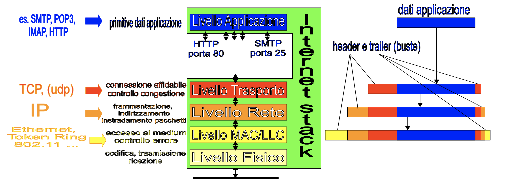

# Livello Applicazione

Il livello applicazione è quello che contiene le API per usare le funzioni che esso stesso mette a disposizione.

Alcune famose applicazioni di rete sono:

- Email (SMPT, POP3, IMAP)
- World wide web
- DNS
- HTTP

I protocolli fra il livello applicazione e quello trasporto, cioè i livelli sessione e presentazione, non sono usati nell'architettura dei protocolli di internet, che quindi con il livello applicazione si compone in totale di 5 livelli.

Il livello applicazione quindi si basa direttamente sul livello trasporto e per questo motivo molte applicazioni che richiedono servizi connection-oriented si basano sul protocollo TCP usando numeri di porta che nel tempo sono diventati di fatto degli standard, questi sono detti **Well-known port numbers**, ad esempio:

- HTTP usa sempre la porta 80, mentre HTTPS usa di solito la porta 443;
- SMTP usa sempre la porta 25;
- DNS usa sempre la porta 53;
- E così via.

## Esempi di servizi di livello applicazione

Vediamo alcuni servizi che sono offerti dal livello applicazione.

- Posta elettronica
  - SMTP: Tutti lo usiamo per spedire messaggi di posta a qualcun altro. Il nostro client si connette ad un server con due socket, sopra ognuno di essi c'è un linguaggio (specificato dalle API) che viene usato per inviare le mail.
  - POP3 o IMAP: Sono alternativi l'uno all'altro, IMAP è il più recente dei due e ha API più ricche. Questi protocolli servono a leggere i messaggi in arrivo.
- World Wide Web:
  - Basato sul protocollo HTTP, che è quello usato per trasferire pagine web. L'idea è di avere un testo sul mio computer dove determinate parole sono collegate a dei socket su internet che vengono aperti quando ci clicco sopra e mi aprono la pagina web relativa (un ipertesto). Questa è stata la scintilla iniziale del web. Improvvisamente tutto era diventato dinamico e rapido.

# Servizi client-server e peer-to-peer

Le applicazioni ed i servizi su internet possono essere realizzati secondo due modalità differenti: con l'architettura client-server o con architettura peer-to-peer. In seguito sono state sviluppate anche varie forme ibride.

L'architettura client-server prevedere la presenza di un client che richiede ad un server l'accesso a servizi o applicazioni, i server per l'appunto soddisfano queste richieste. Architetture di tipo client-server sono usate ad esempio per le email, per i servizi DNS, per il WWW.

L'architettura peer-to-peer invece non prevere la distinzione netta dei ruoli, tutti gli host sono contemporaneamente client e server. Ogni host cerca di soddisfare le richieste che riceve e agisce da client quando richiede servizi agli altri host. Classici esempi di servizi P2P sono i servizi di condivisione file come Freenet.
