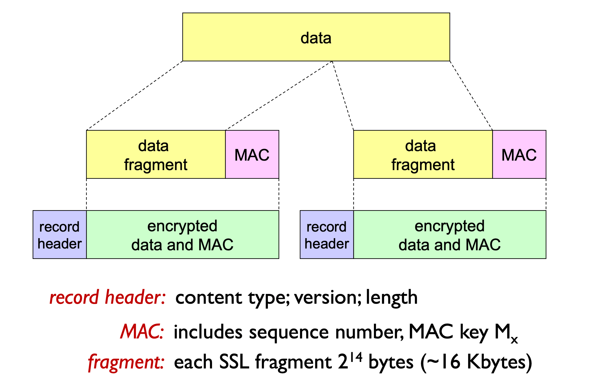

# Cybersecurity

## Introduzione

Chiaramente non c'è bisogno di spiegare perché la cybersecurity è un argomento fondamentale per un corso di reti di calcolatori.
Nel corso della trattazione degli argomenti di cybersecurity si farà spesso ricorso ad un esempio classico della sicurezza informatica noto come Alice e Bob.

Alice e Bob sono due amici (o amanti, come preferite, sono chiamati così perché le iniziali siano A e B) che desiderano comunicare informazioni riservate fra di loro.
Solitamente nella comunicazione fra Alice e Bob interviene un terzo incomodo: Trudy (da intruder), che di volta in volta prova a sottrarre o alterare i dati o inviarne di falsi ad Alice o Bob, i quali devono farsi più furbi di Trudy per comunicare con un ragionevole livello di sicurezza.

Chiaramente non è detto che Alice e Bob siano necessariamente persone reali, potrebbero essere persone come server di online banking come anche router che si scambiano informazioni, si tratta solo di un esempio.

Ora che abbiamo ben chiari i protagonisti del prossimo malloppone di appunti, possiamo andare avanti.

## Alcune note "linguistiche"

Quando si tratta di crittografia bisogna avere presenti alcune abbreviazioni e nomenclature usate per semplificare la trattazione.

- $m$ indica il messaggio **in chiaro** (plaintext message);
- $K_A(m)$ indica il messaggio cifrato con la chiave $K_A$ (la chiave di Alice);
- $m=K_B(K_A(m))$, ovvero la chiave di Bob è l'inversa di quella di Alice.

# Crittografia simmetrica

La crittografia simmetrica è il modo più semplice per proteggere una comunicazione: Alice e Bob si accordano su una chiave comune $K_S$ da usare per cifrare e decifrare i messaggi.

Un banale esempio di scambio di messaggi cifrato con crittografia simmetrica è il [Cifrario di Cesare](https://it.wikipedia.org/wiki/Cifrario_di_Cesare)

Il problema di questa tecnica è che Alice e Bob devono accordarsi sulla chiave da usare. Se si incontrano dal vivo e si scambiano la chiave certamente la connessione sarà cifrata, ma questa modalità non può avvenire sempre: i server di due banche non possono "incontrarsi dal vivo" per concordare una chiave.

> La crittografia simmetrica non sarà utile per scambiare informazioni su internet, ma è utilissima per proteggere ad esempio i nostri hard disk e le nostre chiavi USB, dato che in questo caso solo a noi serve sapere la chiave.

Comunicare la chiave in chiaro all'inizio della comunicazione è inutile e dannoso in quanto all'attaccante basta intercettare la chiave e poi tutti i messaggi saranno come fossero plain-text.

> Nel momento in cui la chiave è comunicata in plain-text non ha più neanche senso tentare di comunicare informazioni private, è come se fossero mandate tutte in plain-text.

## Data Encryption Standard

Il DES è uno dei primi algoritmi di crittografia simmetrica ideati.
Esso fa uso di chiavi da 56 bit.

Ad oggi può essere bypassato con un attacco brute-force in meno di un giorno.

## Advances Encryption Standard

AES è il successore di DES, che ha sostituito a partire dal 2001. È sempre un algoritmo per la crittografia simmetrica; rispetto a DES è molto più sicuro: là dove per bypassare una cifratura in DES con bruteforce basti 1 secondo, per bypassare una cifratura AES che usi la stessa chiave servirebbero 149 bilioni di anni.

## Crittografia a chiave pubblica

Gli algoritmi RSA (Rivest–Shamir–Adleman, dal nome dei ricercatori che lo hanno elaborato) è un algoritmo a chiave pubblica/privata che risolve il problema della crittografia simmetrica: non c'è più bisogno per i comunicanti di scambiarsi la chiave segreta, il mittente userà la chiave pubblica del destinatario per crittare il messaggio e il ricevente a sua volta lo decritterà con la propria chiave privata.

Il meccanismo si basa su complessi algoritmi di aritmetica modulare, il risultato però permette ad Alice di usare la chiave pubblica di Bob (che sarà disponibile in un server o database convidiso con tutti) per cifrare il messaggio che poi solo Bob, con la sua chiave privata, sarà in grado di decifrare.

Per maggiori dettagli sul funzionamento matematico dell'algoritmo rimando alla [pagina wikipedia](<https://en.wikipedia.org/wiki/RSA_(cryptosystem)>).

Ciò che rende RSA sicuro è che, anche conoscendo la chiave pubblica di Bob, abbiamo bisogno di fattorizzarla per trovare la chiave privata $d$ e fattorizzare un numero grande non è un compito semplice.

Il compromesso di questo algoritmo è che è 100 volte più costoso (computazionalmente) di DES, per questo motivo solitamente si usa RSA solo all'inizio di una comunicazione per accordarsi su una chiave simmetrica, in modo da proseguire poi con algoritmi meno esosi di risorse ma (adesso) altrettanto sicuri.

# Autenticazione

Risolto il problema di cifrare la comunicazione se ne pone un altro: l'autenticazione, cioè come fa Bob ad essere sicuro di star parlando con Alice.

## Attacco di tipo Playback

Supponiamo che Bob chieda ad Alice di dimostrare di essere veramente lei inviando un messaggio all'inizio della comunicazione contenente una parola d'ordine che poi alice userà in seguito ogni volta che comunicherà con Bob.

In uno scenario del genere a Trudy basta osservare la comunicazione fra Alice e Bob e copiare la parte iniziale, in cui Alice comunica la parola d'ordine, e inviarla a Bob ogni volta che vuole aprire una comunicazione con lui spacciandosi per Alice.

La soluzione per mitigare questo tipo di attacco Bob può mandare ad Alice un numero R noto come numero _once-in-a-lifetime_, che può essere usato per l'appunto una volta soltanto, che Alice deve restituire cifrato a Bob. Se in futuro Trudy dovesse tentare un playback attack Bob riceverebbe di nuovo la chiave mandata in passato e si renderebbe conto di non star parlando con Alice.

## Digital Signature

Le firme digitali sono tecniche crittografiche analoghe alle firme "analogiche".
Bob usa la sua firma digitale per certificare di essere il creatore/proprietario di un documento che manda ad Alice.
Questa firma è verificabile e non-forgiabile: Alice può dimostrare che la firma appartiene a Bob e nessun altro.

Una volta che Alice riceve il messaggio firmato da Bob con la sua (di Bob) chiave privata, Alice può usare la chaive pubblica di Bob per decifrare il messaggio (un po' l'opposto della RSA concettualmente) e verificare che provenga effettivamente da Bob (o da qualcuno con la sua chiave privata).

## Attacco di tipo Man in the Middle

Trudy si è accorta che non riesce più ad origliare le conversazioni di Alice e Bob e decide di passare ad un attacco di tipo **man-in-the-middle**.

In un attacco di tipo man-in-the-middle, Trudy intercetta le comunicazioni di Alice e Bob e consegna ad ognuno di loro delle chiavi pubbliche che in realtà sono di Trudy, in questo modo potrà intercettare tutti i messaggi da una parte e dall'altra e farne quello che vuole: per restare trasparente e non rendere nota l'infrazione a Trudy basterà inoltrare i messaggi da un capo all'altro della comunicazione.

Il rimedio ai tipi di attacco man-in-the-middle è l'uso di chiavi pubbliche _certificate_.

## Public-key certification

Per evitare attacchi di tipo man-in-the-middle si fa ricorso ad enti terzi che certifichino l'autenticità delle chiavi pubbliche che Alice e Bob si scambiano.

Anziché scambiarsi direttamente le chiavi, sia Alice che Bob registrano la propria chiave presso una [**Certificate Authority** (CA)](https://en.wikipedia.org/wiki/Certificate_authority) e, nel momento in cui vorranno comunicare fra loro, richiederanno alle rispettive CA la chiave dell'altro.

A questo punto Trudy non potrà più spacciarsi per Alice o Bob in quanto la CA garantisce solo le vere chiavi di Alice e Bob.

Trudy però non vuole lasciare e decide di raddoppiare la posta: mette sù un man-in-the-middle attack in cui Trudy questa volta impersona anche le CA di Alice e Bob.

Per mitigare questa casistica le CA sono a loro volta certificate da altre CA, creando un network che di fatto impone a Trudy di perpetrare molti man-in-the-middle attacks per riuscire ad entrare nella conversazione fra Alice e Bob. Non è impossibile ma è certamente molto molto difficile.

# E-mail sicure

Supponiamo che Alice voglia mandare una mail confidenziale a Bob.
Come abbiamo visto, i passaggi che Alice dovrebbe seguire sono:

- Generare delle chiavi simmetriche casuali $K_S$;
- Cifrare i messaggi con le chiavi $K_S$;
- Cifrare $K_S$ con la chiave pubblica di Bob $K_B$;
- Inviare a Bob sia il messaggio cifrato $K_S(m)$ che la chiave cifrate $K_B(K_S)$.

A questo punto Bob con la sua chiave privata può decifrare la chiave simmetrica e usarla a sua volta per decifrare il messaggio mandato da Alice.

Come abbiamo visto la cifratura non basta, Alice quindi vuole anche firmare il messaggio in modo che Bob sappia che proviene da lei e nessun altro.
In sostanza Alice vuole che la comunicazione abbia le proprietà di: security, sender authentication, message integrity.

Per ottenere ciò Alice userà quindi 3 chiavi: la chiave simmetrica $K_S$ per cifrare il messaggio, la chiave pubblica di Bob $K_B$ per cifrare la chiave simmetrica e infine la propria chiave privata $K_A$ per firmare il messaggio, usando quindi tutte le tecniche che abbiamo visto prima.

# Rendere sicure le connessioni TCP: SSL

Per garantire integrità, sicurezza e autenticazione agli applicativi web che fanno uso del protocollo TCP la tecnologia più usata è **SSL (Secure Socket Layer)**.

SSL è disponibile per tutte le applicazioni che fanno uso di TCP: si pone fra l'applicazione ed il protocollo TCP e fornisce le API per rendere sicura una connessione.

SSL utilizza 4 chiavi per realizzare una comunicazione: la chiave di cifratura del client, la chiave **MAC (message authentication code)** del client, la chiave di cifratura del server e la chiave MAC del server. la chiave MAC viene usata per l'appunto per autenticare i messaggi scambiati.

La tecnologia SSL prevede un **Handshake** per iniziare la conversazioen.

Durante l'handshake si autentica il server, viene negoziato un accordo sull'algoritmo di cifratura da usare, si generano le chiavi e (opzionale) si autentica il client.

Nello specifico il client fornisce al server una lista di algoritmi di cifratura che può usare e il server restituirà al client l'algoritmo scelto e il certificato.
Il client quindi verifica il certificato del server, prende la chiave pubblica del server e cifra il pre_master_secret che poi invia al server.
A questo punto sia client che server useranno il pre_master_secret per generare le chiavi di cifratura e MAC ed entrambi aggiungeranno il MAC per tutti i successivi messaggi dela fare handshake.

# Rendere sicuro il livello rete: IPsec

Rendere sicuro il livello network ha senso per proteggere tutta una serie di dati: dalle pagine web alle email, ai messaggi ICMP.

Fra le varie tecniche per proteggere la comunicazione a livello rete ci sono: VPN e IPsec

## Le VPN

Sono usate (ad esempio) dalle imprese e dalle istituzioni per fornire una rete protetta ai dipendenti. Sono costose da realizzare in quanto bisogna predisporre dei router appositi e una infrastruttura DNS.

In pratica le VPN permettono di gestire il traffico 'inner-office' usando la rete internet pubblica, in quanto tutte le comunicazioni sono cifrate prima di accedere ad internet e sono logicamente separate dall'altro traffico.

## IPsec

I servizi IPsec forniscono le solite proprietà di integrità dei dati, autenticazione, protezione dai playback attack e confidenzialità della conversazione.

IPsec è fornita da due protocolli: AH e ESP.

- **Authentication Header (AH)** fornisce autenticazione della provenienza e integrità dei dati ma non la confidenzialità
- **Encapsulation Security Protocol (ESP)** fornisce anche la confidenzialità ed infatti è più usato di AH.

### Security Associations (SA)

Vengono realizzate all'inizio della comunicazione fra il mittente ed il destinatario, entrambi conservano informazioni sullo stato della SA, in questo modo si passa da un protocollo connectionless, IP, ad uno connection-oriented, IPsec.

Le SA sono usate assieme ad esempio alle VPN per stabilire una connessione sicura fra due entità (ad esempio un computer di un azienda che acceda dall'esterno della rete aziendale), in quanto fra le altre cose permettono di conservare le informazioni sul tipo di algoritmo di cifratura accordato, sugli identificatori usati e sulle chiavi di autenticazione e cifratura.

Solitamente gli endpoint conservano le informazioni in dei database chiamati SAD.

## Internet Key Exchange (IKE)

IKE è un servizio che si usa per lo scambio di chiavi di cifratura/autenticazione quando non è possibile eseguire il processo a mano (ad esempio per gestire VPN con centinaia di endpoints).

IKE gestisce l'autenticazione tramite o chiavi condivise a monte (PSK, pre shared keys) o tramite il meccanismo di chiave pubblica e certificazione.

IKE opera in due fasi:

1. Nella prima fase viene stabilita la SA bi-direzionale, conosciuta come ISAKMP security association;
2. Nella seconda fase ISAKMP viene usata per negoziare in modo sicuro le coppie di SA usate per IPsec.

## Riassumendo

IPsec usa essenzialmente due tecnologie per gestire la comunicazione:

- IKE per stabilire gli algoritmi di cifratura, scambiare le chiavi e i numeri SPI;
- AH o ESP per fornire integrità, autenticazione e confidenzialità alla conversazione.

Gli Alice e Bob di una conversazione IPsec possono essere due end systems, due router/firewall oppure un end system ed un router/firewall.

# Mettere al sicuro le reti locali (LAN)

Per evitare che una persona esterna manometta o osservi le comunicazioni all'interno di una rete locale sono stati nel tempo ideati diversi algoritmi.

## WEP

L'algoritmo WEP è pensato per utilizzare un sistema di cifratura simmetrica, per essere self-synchronizing (ovvero ogni pacchetto è cifrato autonomamente senza per questo rischiare di non accorgersi di aver perso un pacchetto) e per essere efficiente ed implementabile sia tramite hardware che software.

Il protocollo prevede che il mittente:

- Calcoli l'ICV (Integrity Check Value), un hash di 4 byte, sui dati inviati;
- I due comunicanti hanno una chiave condivisa di 104 bit;
- Crei un vettore di inizializzazione (IV) di 24 bit e lo aggiunge alla chiave, ottenendo così una chiave di 128 bit;
- Aggiunga anche una chiave identificativa di 8 bit;
- La precedente chiave di 128 bit viene data in input ad un generatore di numeri random per ottenere il keystream;
- I dati del frame e la ICV vengono cifrati con l'algoritmo RC4 e poi il payload viene mandato al destinatario.

Il destinatario dal canto suo:

- Estrae il vettore di inizializzazione;
- Usa l'IV e la chiave condivisa come input per un generatore pseudo casuale per ottenere il keystream;
- Con uno XOR fra il keystream e i dati cifrati si decifrano i dati e il ICV;
- L'integrità dei dati viene verificata con l'ICV e la comunicazione può dirsi conclusa.

### Perché non si usa più WEP

WEP non è più uno standard sicuro a causa di un security hole che è parte del protocollo stesso:
dal momento che l'IV è composto di soli 24 bit e dato che ne viene utilizzato uno per ogni frame scambiato, prima o poi si riutilizzeranno gli stessi IV e, dato che l'IV viene inviato in chiaro, è facile per Trudy capire quando un IV viene riutilizzato.

Non appena Trudy identifica un IV riutilizzato può usare il dato per calcolare la chiave condivisa. Facendo questa operazione per tutti gli IV riutilizzati che trova Trudy è in grado di risalire a tutte le chiavi condivise e, la volta successiva, intercettare e decifrare i pacchetti.

Ormai è sconsigliato utilizzare WEP, lo standard di riferimento attuale è WPA2.

# I Firewall

I firewall isolano una rete da internet permettendo l'ingresso solo di pacchetti selezionati.
Sono molto utili per prevenire gli attacchi DoS, per impedire l'accesso e la modifica illegali di dati interni, permettere solo alle entità autorizzate di accedere al network.

I firewall possono essere di tre tipi:

- **Stateless packet filtering**

  I dispositivi interni sono connessi ad internet mediante il firewall del router, il quale filtra ogni pacchetto decidendo se farlo passare o meno (la decisione viene presa in base agli indirizzi IP, alle porte TCP o UDP e ai messaggi ICMP contenuti nei pacchetti);

  Esempio: il router blocca tutti i segmenti TCP interni contenenti ACK=0, con il risultato che nessun computer esterno possa connettersi come client ad uno interno, ma tutti i computer interni possono connettersi a server esterni;

- **Stateful packet filtering**

  A differenza dell'approccio stateless, in questo tipo di firewall viene tracciato lo status di ogni connessione TCP per capire quali pacchetti in transito abbiano senso (se una connessione è stata buttata formalmente giù non ha senso far transitare altri pacchetti in seguito);

- **Application gateways**

  Questo tipo di firewall filtra i pacchetti basandosi sui dati delle applicazioni e sui campi IP/TCP/UDP.

I firewall però non sono infallibili: sono suscettibili ad attacchi di IP spoofing (non hanno modo di verificare che l'IP che proclama il pacchetto sia effettivamente il suo).
Inoltre non sono strumenti senza compromessi: per godere del livello di protezione garantito dai firewall bisogna rinunciare ad un certo grado di comunicazione con il mondo esterno.
