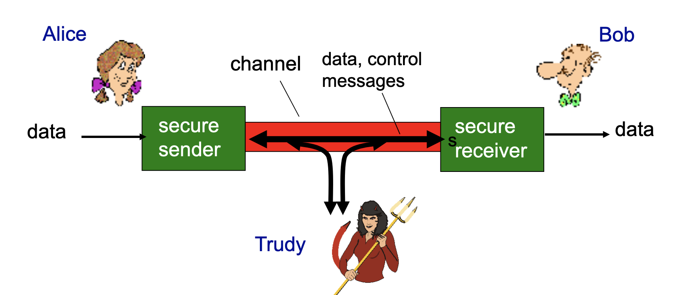
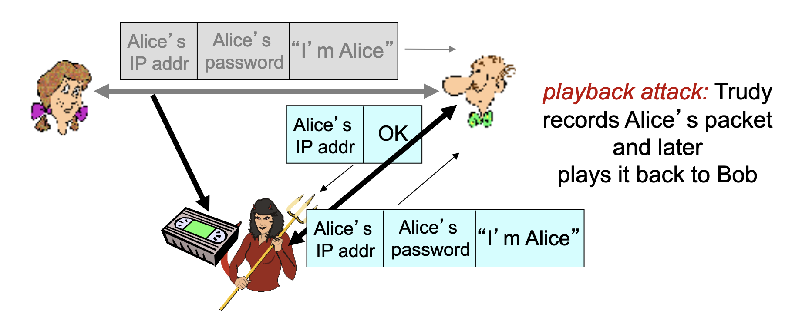
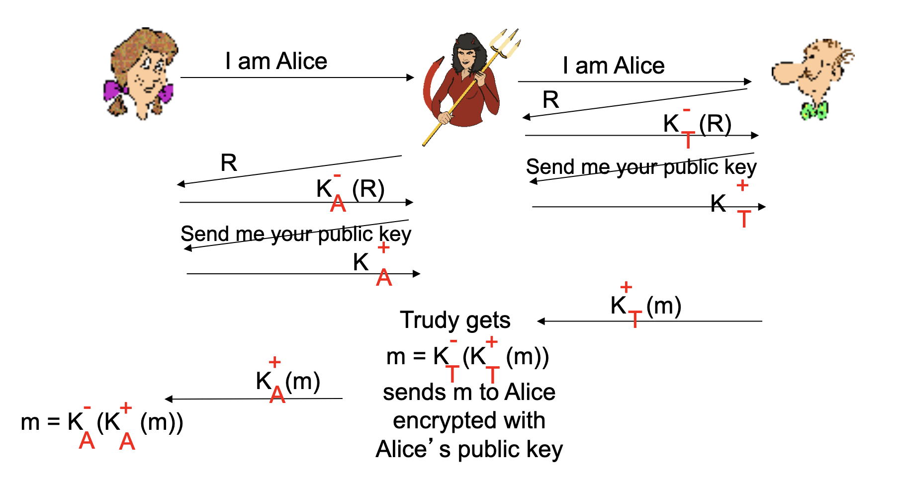

# Cybersecurity

## Introduzione

Chiaramente non c'è bisogno di spiegare perché la cybersecurity è un argomento fondamentale per un corso di reti di calcolatori.
Nel corso della trattazione degli argomenti di cybersecurity si farà spesso ricorso ad un esempio classico della sicurezza informatica noto come Alice e Bob.

Alice e Bob sono due amici (o amanti, come preferite, sono chiamati così perché le iniziali siano A e B) che desiderano comunicare informazioni riservate fra di loro.
Solitamente nella comunicazione fra Alice e Bob interviene un terzo incomodo: Trudy (da intruder), che di volta in volta prova a sottrarre o alterare i dati o inviarne di falsi ad Alice o Bob, i quali devono farsi più furbi di Trudy per comunicare con un ragionevole livello di sicurezza.

Chiaramente non è detto che Alice e Bob siano necessariamente persone reali, potrebbero essere persone come server di online banking come anche router che si scambiano informazioni, si tratta solo di un esempio.

Ora che abbiamo ben chiari i protagonisti del prossimo malloppone di appunti, possiamo andare avanti.

## Alcune note "linguistiche"

Quando si tratta di crittografia bisogna avere presenti alcune abbreviazioni e nomenclature usate per semplificare la trattazione.

- $m$ indica il messaggio **in chiaro** (plaintext message);
- $K_A(m)$ indica il messaggio cifrato con la chiave $K_A$ (la chiave di Alice);
- $m=K_B(K_A(m))$, ovvero la chiave di Bob è l'inversa di quella di Alice.

# Crittografia simmetrica

La crittografia simmetrica è il modo più semplice per proteggere una comunicazione: Alice e Bob si accordano su una chiave comune $K_S$ da usare per cifrare e decifrare i messaggi.

Un banale esempio di scambio di messaggi cifrato con crittografia simmetrica è il [Cifrario di Cesare](https://it.wikipedia.org/wiki/Cifrario_di_Cesare)

Il problema di questa tecnica è che Alice e Bob devono accordarsi sulla chiave da usare. Se si incontrano dal vivo e si scambiano la chiave certamente la connessione sarà cifrata, ma questa modalità non può avvenire sempre: i server di due banche non possono "incontrarsi dal vivo" per concordare una chiave.

> La crittografia simmetrica non sarà utile per scambiare informazioni su internet, ma è utilissima per proteggere ad esempio i nostri hard disk e le nostre chiavi USB, dato che in questo caso solo a noi serve sapere la chiave.

Comunicare la chiave in chiaro all'inizio della comunicazione è inutile e dannoso in quanto all'attaccante basta intercettare la chiave e poi tutti i messaggi saranno come fossero plain-text.

> Nel momento in cui la chiave è comunicata in plain-text non ha più neanche senso tentare di comunicare informazioni private, è come se fossero mandate tutte in plain-text.

## Data Encryption Standard

Il DES è uno dei primi algoritmi di crittografia simmetrica ideati.
Esso fa uso di chiavi da 56 bit.

Ad oggi può essere bypassato con un attacco brute-force in meno di un giorno.

## Advances Encryption Standard

AES è il successore di DES, che ha sostituito a partire dal 2001. È sempre un algoritmo per la crittografia simmetrica; rispetto a DES è molto più sicuro: là dove per bypassare una cifratura in DES con bruteforce basti 1 secondo, per bypassare una cifratura AES che usi la stessa chiave servirebbero 149 bilioni di anni.

## Crittografia a chiave pubblica

Gli algoritmi RSA (Rivest–Shamir–Adleman, dal nome dei ricercatori che lo hanno elaborato) è un algoritmo a chiave pubblica/privata che risolve il problema della crittografia simmetrica: non c'è più bisogno per i comunicanti di scambiarsi la chiave segreta, il mittente userà la chiave pubblica del destinatario per crittare il messaggio e il ricevente a sua volta lo decritterà con la propria chiave privata.

Il meccanismo si basa su complessi algoritmi di aritmetica modulare, il risultato però permette ad Alice di usare la chiave pubblica di Bob (che sarà disponibile in un server o database convidiso con tutti) per cifrare il messaggio che poi solo Bob, con la sua chiave privata, sarà in grado di decifrare.

Per maggiori dettagli sul funzionamento matematico dell'algoritmo rimando alla [pagina wikipedia](<https://en.wikipedia.org/wiki/RSA_(cryptosystem)>).

Ciò che rende RSA sicuro è che, anche conoscendo la chiave pubblica di Bob, abbiamo bisogno di fattorizzarla per trovare la chiave privata $d$ e fattorizzare un numero grande non è un compito semplice.

Il compromesso di questo algoritmo è che è 100 volte più costoso (computazionalmente) di DES, per questo motivo solitamente si usa RSA solo all'inizio di una comunicazione per accordarsi su una chiave simmetrica, in modo da proseguire poi con algoritmi meno esosi di risorse ma (adesso) altrettanto sicuri.

# Autenticazione

Risolto il problema di cifrare la comunicazione se ne pone un altro: l'autenticazione, cioè come fa Bob ad essere sicuro di star parlando con Alice.

## Attacco di tipo Playback

Supponiamo che Bob chieda ad Alice di dimostrare di essere veramente lei inviando un messaggio all'inizio della comunicazione contenente una parola d'ordine che poi alice userà in seguito ogni volta che comunicherà con Bob.

In uno scenario del genere a Trudy basta osservare la comunicazione fra Alice e Bob e copiare la parte iniziale, in cui Alice comunica la parola d'ordine, e inviarla a Bob ogni volta che vuole aprire una comunicazione con lui spacciandosi per Alice.

La soluzione per mitigare questo tipo di attacco Bob può mandare ad Alice un numero R noto come numero _once-in-a-lifetime_, che può essere usato per l'appunto una volta soltanto, che Alice deve restituire cifrato a Bob. Se in futuro Trudy dovesse tentare un playback attack Bob riceverebbe di nuovo la chiave mandata in passato e si renderebbe conto di non star parlando con Alice.

## Digital Signature

Le firme digitali sono tecniche crittografiche analoghe alle firme "analogiche".
Bob usa la sua firma digitale per certificare di essere il creatore/proprietario di un documento che manda ad Alice.
Questa firma è verificabile e non-forgiabile: Alice può dimostrare che la firma appartiene a Bob e nessun altro.

Una volta che Alice riceve il messaggio firmato da Bob con la sua (di Bob) chiave privata, Alice può usare la chaive pubblica di Bob per decifrare il messaggio (un po' l'opposto della RSA concettualmente) e verificare che provenga effettivamente da Bob (o da qualcuno con la sua chiave privata).

## Attacco di tipo Man in the Middle

Trudy si è accorta che non riesce più ad origliare le conversazioni di Alice e Bob e decide di passare ad un attacco di tipo **man-in-the-middle**.

In un attacco di tipo man-in-the-middle, Trudy intercetta le comunicazioni di Alice e Bob e consegna ad ognuno di loro delle chiavi pubbliche che in realtà sono di Trudy, in questo modo potrà intercettare tutti i messaggi da una parte e dall'altra e farne quello che vuole: per restare trasparente e non rendere nota l'infrazione a Trudy basterà inoltrare i messaggi da un capo all'altro della comunicazione.

Il rimedio ai tipi di attacco man-in-the-middle è l'uso di chiavi pubbliche _certificate_.

## Public-key certification

Per evitare attacchi di tipo man-in-the-middle si fa ricorso ad enti terzi che certifichino l'autenticità delle chiavi pubbliche che Alice e Bob si scambiano.

Anziché scambiarsi direttamente le chiavi, sia Alice che Bob registrano la propria chiave presso una [**Certificate Authority** (CA)](https://en.wikipedia.org/wiki/Certificate_authority) e, nel momento in cui vorranno comunicare fra loro, richiederanno alle rispettive CA la chiave dell'altro.

A questo punto Trudy non potrà più spacciarsi per Alice o Bob in quanto la CA garantisce solo le vere chiavi di Alice e Bob.

Trudy però non vuole lasciare e decide di raddoppiare la posta: mette sù un man-in-the-middle attack in cui Trudy questa volta impersona anche le CA di Alice e Bob.

Per mitigare questa casistica le CA sono a loro volta certificate da altre CA, creando un network che di fatto impone a Trudy di perpetrare molti man-in-the-middle attacks per riuscire ad entrare nella conversazione fra Alice e Bob. Non è impossibile ma è certamente molto molto difficile.

# E-mail sicure

Riprendi da slide 56
