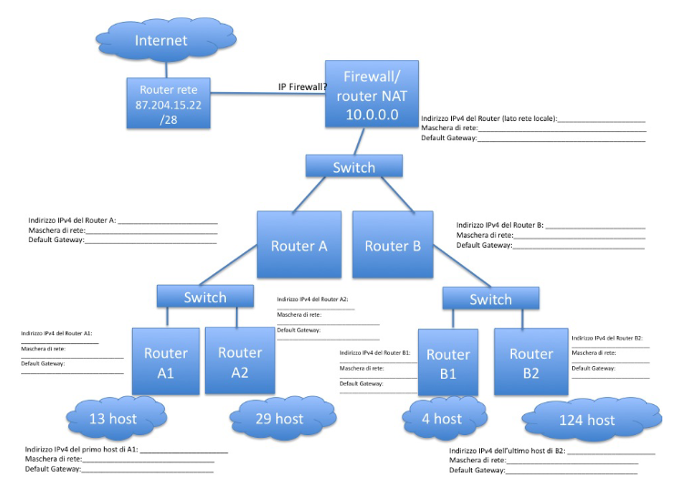

<!-- omit in toc -->
# Ripasso Generale Reti Di Calcolatori
- [**1)** Dato l'indirizzo IP 130.136.128.128 con maschera di rete 255.255.128.0 quante sottoreti sono individuate e a quale sottorete appartiene l'indirizzo suddetto?](#1-dato-lindirizzo-ip-130136128128-con-maschera-di-rete-2552551280-quante-sottoreti-sono-individuate-e-a-quale-sottorete-appartiene-lindirizzo-suddetto)
- [**2)** A quale sottorete appartiene l’indirizzo IPv4: 130.136.9.1 se la maschera di rete è 255.255.248.0? (suggerimento: 248 è pari a 128+64+32+16+8)](#2-a-quale-sottorete-appartiene-lindirizzo-ipv4-13013691-se-la-maschera-di-rete-è-2552552480-suggerimento-248-è-pari-a-1286432168)
- [**3)** Come si esprime 37 in binario?](#3-come-si-esprime-37-in-binario)
- [**4)** quale numero di host ha la macchina con indirizzo IPv4 130.136.249.0 / 23 se utilizzo la notazione CIDR per esprimere la sottorete a cui appartiene (indicando /23)?](#4-quale-numero-di-host-ha-la-macchina-con-indirizzo-ipv4-1301362490--23-se-utilizzo-la-notazione-cidr-per-esprimere-la-sottorete-a-cui-appartiene-indicando-23)
- [**5)** E se l’indirizzo IP della domanda precedente fosse stato 250.129.9.132 con maschera CIDR /25?](#5-e-se-lindirizzo-ip-della-domanda-precedente-fosse-stato-2501299132-con-maschera-cidr-25)
- [**6)** Quante reti IP di classe B si “fondono” tra loro se utilizzo una maschera di rete /13?](#6-quante-reti-ip-di-classe-b-si-fondono-tra-loro-se-utilizzo-una-maschera-di-rete-13)
- [**7)** Quali classi di rete IPv4 posso utilizzare se voglio poter indirizzare al massimo 300 host della mia rete locale? E se ne voglio indirizzare almeno 300 host?](#7-quali-classi-di-rete-ipv4-posso-utilizzare-se-voglio-poter-indirizzare-al-massimo-300-host-della-mia-rete-locale-e-se-ne-voglio-indirizzare-almeno-300-host)
- [**8)** Quali dei seguenti sono indirizzi IPv4 leciti?](#8-quali-dei-seguenti-sono-indirizzi-ipv4-leciti)
- [**9)** Dato l’indirizzo IP 130.136.5.128 con maschera di rete 255.255.255.0 quante sottoreti sono individuate e a quale sottorete appartiene l’indirizzo suddetto? Quale è il primo e l'ultimo indirizzo IPv4 utile (cioè assegnabile a un host) della sottorete individuata? (scrivere i due indirizzi IPv4 per intero)](#9-dato-lindirizzo-ip-1301365128-con-maschera-di-rete-2552552550-quante-sottoreti-sono-individuate-e-a-quale-sottorete-appartiene-lindirizzo-suddetto-quale-è-il-primo-e-lultimo-indirizzo-ipv4-utile-cioè-assegnabile-a-un-host-della-sottorete-individuata-scrivere-i-due-indirizzi-ipv4-per-intero)
- [**10)** Dato l’indirizzo IP 130.136.5.128 /23, ovvero con maschera di rete 255.255.__.0, quante sottoreti sono individuate e a quale sottorete appartiene l’indirizzo suddetto? Quale è il numero di host dell'host corrispondente all'indirizzo IPv4 sopra indicato per questa sottorete? Quale è il primo e l'ultimo indirizzo IPv4 utile (cioè assegnabile a un host) della sottorete individuata? (scrivere i due indirizzi IPv4 per intero)](#10-dato-lindirizzo-ip-1301365128-23-ovvero-con-maschera-di-rete-255255__0-quante-sottoreti-sono-individuate-e-a-quale-sottorete-appartiene-lindirizzo-suddetto-quale-è-il-numero-di-host-dellhost-corrispondente-allindirizzo-ipv4-sopra-indicato-per-questa-sottorete-quale-è-il-primo-e-lultimo-indirizzo-ipv4-utile-cioè-assegnabile-a-un-host-della-sottorete-individuata-scrivere-i-due-indirizzi-ipv4-per-intero)
- [**11)** Dato l’indirizzo IP 130.136.5.128 /21, ovvero con maschera di rete 255.255.__.0, quante sottoreti sono individuate e a quale sottorete appartiene l’indirizzo suddetto? Quale è il numero di host dell'host corrispondente all'indirizzo IPv4 sopra indicato per questa sottorete? Quale è il primo e l'ultimo indirizzo IPv4 utile (cioè assegnabile a un host) della sottorete individuata? (scrivere i due indirizzi IPv4 per intero)](#11-dato-lindirizzo-ip-1301365128-21-ovvero-con-maschera-di-rete-255255__0-quante-sottoreti-sono-individuate-e-a-quale-sottorete-appartiene-lindirizzo-suddetto-quale-è-il-numero-di-host-dellhost-corrispondente-allindirizzo-ipv4-sopra-indicato-per-questa-sottorete-quale-è-il-primo-e-lultimo-indirizzo-ipv4-utile-cioè-assegnabile-a-un-host-della-sottorete-individuata-scrivere-i-due-indirizzi-ipv4-per-intero)
- [**12)** L'esecuzione del comando `tracert flora.cs.unibo.it` producei seguenti output:passo indirizzo IP RTT, questo significa che esiste un cammino su Internet funzionante verso `flora.cs.unibo.it`, oppure no?](#12-lesecuzione-del-comando-tracert-floracsuniboit-producei-seguenti-outputpasso-indirizzo-ip-rtt-questo-significa-che-esiste-un-cammino-su-internet-funzionante-verso-floracsuniboit-oppure-no)
- [**13)** Analizzando i dati, come mai alcuni router più lontani mostrano tempi di RTT minori di router più vicini? come è possibile? è possibile valutare quale sia il router tra quelli elencati in media più congestionato? Perchè?](#13-analizzando-i-dati-come-mai-alcuni-router-più-lontani-mostrano-tempi-di-rtt-minori-di-router-più-vicini-come-è-possibile-è-possibile-valutare-quale-sia-il-router-tra-quelli-elencati-in-media-più-congestionato-perchè)
- [**14)** Come disegnereste la topologia di una rete locale, basata su tecnologia Ethernet, che permetta di connettere 1 Router/ADSL verso Internet (con due schede di rete) per fornire accesso a 64 PC (ognuno con una sola scheda di rete) suddivisi equamente in 3 laboratori diversi dello stesso edificio, e tre stampanti di rete IPv4, in modo che ogni laboratorio abbia accesso alla propria stampante di rete sul proprio segmento di rete locale Ethernet, un mail server, un firewall e un antivirus server, e avendo a disposizione per l'acquisto solo Hub a 4 porte (costo 30 Euro) e Switch a 24 porte (costo 300 Euro)? Considerate separatamente aspetti di efficienza, affidabilità, prestazioni e costo totale.](#14-come-disegnereste-la-topologia-di-una-rete-locale-basata-su-tecnologia-ethernet-che-permetta-di-connettere-1-routeradsl-verso-internet-con-due-schede-di-rete-per-fornire-accesso-a-64-pc-ognuno-con-una-sola-scheda-di-rete-suddivisi-equamente-in-3-laboratori-diversi-dello-stesso-edificio-e-tre-stampanti-di-rete-ipv4-in-modo-che-ogni-laboratorio-abbia-accesso-alla-propria-stampante-di-rete-sul-proprio-segmento-di-rete-locale-ethernet-un-mail-server-un-firewall-e-un-antivirus-server-e-avendo-a-disposizione-per-lacquisto-solo-hub-a-4-porte-costo-30-euro-e-switch-a-24-porte-costo-300-euro-considerate-separatamente-aspetti-di-efficienza-affidabilità-prestazioni-e-costo-totale)
- [**15)** Immaginate di possedere una rete di classe A di indirizzo 20.0.0.0 e supponete di volere progettare l'assegnazione e configurazione degli indirizzi IPv4 su una rete come quella disegnata in figura. Progettate il subnetting della rete (definire le sottoreti) in modo che siano sprecati il minor numero possibile di indirizzi IP, e garantendo la gerarchia della rete secondo lo schema dei router sotto indicati. Completare lo schema con le informazioni di configurazione IPv4 di ogni router e degli host client (a campione) sotto indicati.](#15-immaginate-di-possedere-una-rete-di-classe-a-di-indirizzo-20000-e-supponete-di-volere-progettare-lassegnazione-e-configurazione-degli-indirizzi-ipv4-su-una-rete-come-quella-disegnata-in-figura-progettate-il-subnetting-della-rete-definire-le-sottoreti-in-modo-che-siano-sprecati-il-minor-numero-possibile-di-indirizzi-ip-e-garantendo-la-gerarchia-della-rete-secondo-lo-schema-dei-router-sotto-indicati-completare-lo-schema-con-le-informazioni-di-configurazione-ipv4-di-ogni-router-e-degli-host-client-a-campione-sotto-indicati)
- [**16)** Internet è una rete a commutazione di circuito? Perché?](#16-internet-è-una-rete-a-commutazione-di-circuito-perché)
- [**17)** Descrivere almeno 3 fattori che determinano il throughput di comunicazione di una rete di calcolatori (quantità di bit di dati al secondo ricevuti con successo dal destinatario)](#17-descrivere-almeno-3-fattori-che-determinano-il-throughput-di-comunicazione-di-una-rete-di-calcolatori-quantità-di-bit-di-dati-al-secondo-ricevuti-con-successo-dal-destinatario)
- [**18)** Quali tecnologie di rete locale tra quelle viste a lezione usano un canale di comunicazione ad accesso multiplo (broadcast)?](#18-quali-tecnologie-di-rete-locale-tra-quelle-viste-a-lezione-usano-un-canale-di-comunicazione-ad-accesso-multiplo-broadcast)
- [**19)** Meglio una rete che invia 10 Mb/s con un ritardo di 1 secondo o una rete che invia 1Mb/s con un ritardo di 100 ms? Motivare la risposta](#19-meglio-una-rete-che-invia-10-mbs-con-un-ritardo-di-1-secondo-o-una-rete-che-invia-1mbs-con-un-ritardo-di-100-ms-motivare-la-risposta)
- [**20)** Quali componenti gestiscono la comunicazione di rete IPv4 a livello Rete (3)? Quali compiti assolvono?](#20-quali-componenti-gestiscono-la-comunicazione-di-rete-ipv4-a-livello-rete-3-quali-compiti-assolvono)
- [**21)** Il protocollo UDP si differenzia da TCP? Come? A quale livello sono implementati](#21-il-protocollo-udp-si-differenzia-da-tcp-come-a-quale-livello-sono-implementati)
- [**22)** A quale classe appartengono i seguenti indirizzi IPv4?](#22-a-quale-classe-appartengono-i-seguenti-indirizzi-ipv4)
- [**23)** sono equivalenti il controllo di flusso e il controllo di congestione in TCP? Da quali fattori sono governati?](#23-sono-equivalenti-il-controllo-di-flusso-e-il-controllo-di-congestione-in-tcp-da-quali-fattori-sono-governati)
- [**24)** Un calcolatore può essere connesso a Internet senza disporre di una maschera di rete e di un DNS server? E nel caso di una connessione wireless a Internet?](#24-un-calcolatore-può-essere-connesso-a-internet-senza-disporre-di-una-maschera-di-rete-e-di-un-dns-server-e-nel-caso-di-una-connessione-wireless-a-internet)
- [**25)** A cosa serve il protocollo ICMP? Quali applicazioni viste a lezione si basano su tale protocollo?](#25-a-cosa-serve-il-protocollo-icmp-quali-applicazioni-viste-a-lezione-si-basano-su-tale-protocollo)
- [**26)** Quali di queste sono maschere di rete legali? (suggerimento: considerare anche il valore in binario)](#26-quali-di-queste-sono-maschere-di-rete-legali-suggerimento-considerare-anche-il-valore-in-binario)
- [**27)** Che utilità ha il meccanismo RTS/CTS nelle reti 802.11?](#27-che-utilità-ha-il-meccanismo-rtscts-nelle-reti-80211)
- [**28)** a quale sottorete appartiene l’indirizzo IPv4: 180.17.225.5 se la maschera di rete è 255.255.240.0? (suggerimento: 240 è pari a 128+64+32+16)](#28-a-quale-sottorete-appartiene-lindirizzo-ipv4-180172255-se-la-maschera-di-rete-è-2552552400-suggerimento-240-è-pari-a-128643216)
- [**29)** Come si esprime 97 in binario?](#29-come-si-esprime-97-in-binario)
- [**31)** Quali sono il primo e l'ultimo indirizzo IPv4 utile per la sottorete 130.136.249.0? e a quali sottoreti apparterrebbero gli host ai quali fossero attribuiti i due indirizzi suddetti se la maschera di rete fosse /22?](#31-quali-sono-il-primo-e-lultimo-indirizzo-ipv4-utile-per-la-sottorete-1301362490-e-a-quali-sottoreti-apparterrebbero-gli-host-ai-quali-fossero-attribuiti-i-due-indirizzi-suddetti-se-la-maschera-di-rete-fosse-22)
- [**32)** Quanti host puo contenere la rete di cui e' router il nodo 190.12.32.47/23? E se la maschera di rete fosse 255.255.255.0? E se la maschera di rete fosse 255.255.255.128?](#32-quanti-host-puo-contenere-la-rete-di-cui-e-router-il-nodo-19012324723-e-se-la-maschera-di-rete-fosse-2552552550-e-se-la-maschera-di-rete-fosse-255255255128)
- [**33)** Sono disponibili indirizzi IPv4 a partire da 130.136.17.0 e si vogliono attribuire indirizzi IPv4 a 3 diversi domini di rete X, Y, K composti rispettivamente da 100, 60, e 10 indirizzi, sprecandone il meno possibile. Come possono essere identificate le sottoreti X,Y,K e quali sono gli indirizzi di rete e di broadcast per ognuna di loro?](#33-sono-disponibili-indirizzi-ipv4-a-partire-da-130136170-e-si-vogliono-attribuire-indirizzi-ipv4-a-3-diversi-domini-di-rete-x-y-k-composti-rispettivamente-da-100-60-e-10-indirizzi-sprecandone-il-meno-possibile-come-possono-essere-identificate-le-sottoreti-xyk-e-quali-sono-gli-indirizzi-di-rete-e-di-broadcast-per-ognuna-di-loro)
- [**34)** In quali modalita si puo configurare il funzionamento di un access point WI-FI 802.11?](#34-in-quali-modalita-si-puo-configurare-il-funzionamento-di-un-access-point-wi-fi-80211)
- [**35)** A quale sottorete appartiene l’indirizzo IPv4: 130.136.17.1 se la maschera di rete è 255.255.240.0? (suggerimento: 240 è pari a 128+64+32+16) (scrivere il procedimento sotto)](#35-a-quale-sottorete-appartiene-lindirizzo-ipv4-130136171-se-la-maschera-di-rete-è-2552552400-suggerimento-240-è-pari-a-128643216-scrivere-il-procedimento-sotto)
- [**36)** Quale numero di host ha la macchina con indirizzo IPv4 130.136.247.2 / 22 se utilizzo la notazione CIDR per esprimere la sottorete a cui appartiene (indicando /22)? (scrivere il procedimento sotto). E a quale sottorete appartiene l’host, nella rete di classe B 130.136.x.y, se uso maschera di rete /22?](#36-quale-numero-di-host-ha-la-macchina-con-indirizzo-ipv4-1301362472--22-se-utilizzo-la-notazione-cidr-per-esprimere-la-sottorete-a-cui-appartiene-indicando-22-scrivere-il-procedimento-sotto-e-a-quale-sottorete-appartiene-lhost-nella-rete-di-classe-b-130136xy-se-uso-maschera-di-rete-22)

## **1)** Dato l'indirizzo IP 130.136.128.128 con maschera di rete 255.255.128.0 quante sottoreti sono individuate e a quale sottorete appartiene l'indirizzo suddetto?

130.136.128.128 si esprime in binario come:

`10000010 10001000 10000000 10000000`

e la maschera di rete `255.255.128.0` si esprime in binario come:

`11111111 11111111 10000000 00000000`

da qui si vede che la rete di classe B `130.136.x.y` viene estesa con un solo bit, quindi possiamo identificare massimo due sottoreti e la nostra sottorete appartiene alla sottorete 1

## **2)** A quale sottorete appartiene l’indirizzo IPv4: 130.136.9.1 se la maschera di rete è 255.255.248.0? (suggerimento: 248 è pari a 128+64+32+16+8)

scriviamo in binario `130.136.9.1`

`10000010 10001000 00001001 00000001`

scriviamo in binario `255.255.248.0`

`11111111 11111111 11111000 00000000`

Quindi il nostro indirizzo apparterra' alla sottorete 00001 -> 1 della rete di classe B

## **3)** Come si esprime 37 in binario?

`0100101`

## **4)** quale numero di host ha la macchina con indirizzo IPv4 130.136.249.0 / 23 se utilizzo la notazione CIDR per esprimere la sottorete a cui appartiene (indicando /23)?

La macchina ha indirizzo ip

`10000010 10001000 11111001 00000000`

e la maschera' di rete e'

`11111111 11111111 11111110 00000000`

Quindi sara' nella sottorete 1111100 -> 124 della rete di classe B

e avra' numero di host

`1 00000000 -> 256`

## **5)** E se l’indirizzo IP della domanda precedente fosse stato 250.129.9.132 con maschera CIDR /25?

in tal caso l’indirizzo è di Classe C e in binario si scrive:

`11111010 10000001 00001001 10000100`

mentre la maschera di rete /25 corrisponde a

`11111111 11111111 11111111 10000000`
da cui si evince che c’è solo un bit che estende il numero di rete di classe C (i primi 3 byte a sinistra).

Esistono quindi solo due sottoreti della rete di classe C.

Il valore corrispondente nell’indirizzo IP per quel bit è 1, quindi appartiene alla sottorete 1 e ha numero di host 0000100 = 4

## **6)** Quante reti IP di classe B si “fondono” tra loro se utilizzo una maschera di rete /13?

/13 equivale a `11111111 11111000 00000000 00000000`

/16 equivale a `11111111 11111111 00000000 00000000` (una rete di classe B)

i bit di differenza sono 3, quindi si fondono 2^3 = 8 reti di classe B in una super-rete.

Notare che non sappiamo nulla degli indirizzi IP, ma ragioniamo solo sulle maschere di rete

## **7)** Quali classi di rete IPv4 posso utilizzare se voglio poter indirizzare al massimo 300 host della mia rete locale? E se ne voglio indirizzare almeno 300 host?

In entrambi i casi e' necessaria al minimo una rete di classe B, che ha la possibilita di indirizzare `65535` host, quindi sia classe B che classe A vanno bene. Una rete di classe C non andrebbe bene perche' puo indirizzare al massimo `254` host.

## **8)** Quali dei seguenti sono indirizzi IPv4 leciti?

Per verificare che un indirizzo IPv4 sia lecito, basta controllare che ci siano quattro valori compresi tra 0 e 255 separati da un punto.

- 120.121.122.123 -> si
- 123.123.321.321 -> no (321 > 255)
- 130.136.256.0 -> no (256 > 255)
- 1.2.3.4 -> si
- 2001:0db8:0:0:1319:8a2e:0307:7344 -> no (indirizzo ipv6)
- www.dominio.it -> no (dominio)
- 1:0:0:0 -> no (due punti?)
- 1.255.1.255 -> si
- AA.BB.CC.DD -> no (le lettere)
- 110.011.110.001 -> tecnicamente credo di no, ma sia curl sia il browser interpretano questo indirizzo ip come 110.11.110.1 (gli zero prima del numero vengono tolti), quindi non sono sicuro. Essenzialmente, se il controllo viene fatto a livello di caratteri, quasi sicuramente questo indirizzo non lo passa, se invece viene fatto tra interi, allora potrebbe anche passare.
- FF.FF.FF.FF.FF.FF -> no (FF?)

## **9)** Dato l’indirizzo IP 130.136.5.128 con maschera di rete 255.255.255.0 quante sottoreti sono individuate e a quale sottorete appartiene l’indirizzo suddetto? Quale è il primo e l'ultimo indirizzo IPv4 utile (cioè assegnabile a un host) della sottorete individuata? (scrivere i due indirizzi IPv4 per intero)

`130.136.5.128` in binario:

`10000010 10001000 00000101 10000000`

`255.255.255.0` in binario:

`11111111 11111111 11111111 00000000`

Questa e' una rete di classe B, quindi per individuare il numero di sottoreti guardiamo la maschera di rete sul terzo byte, vediamo che possiamo indirizzare 256 sottoreti, e l'indirizzo suddetto appartiene alla sottorete 5.

Nella sottorete il primo indirizzo assegnabile e' `130.136.5.0` e l'ultimo e' `130.136.5.255`, detto questo in una rete come convenzione sappiamo che `255` viene utilizzato per il broadcast, `254` viene usato per il router e `0` non viene utilizzato, quindi tecnicamente in una rete reale gli indirizzi vanno da 1 a 253.

## **10)** Dato l’indirizzo IP 130.136.5.128 /23, ovvero con maschera di rete 255.255.__.0, quante sottoreti sono individuate e a quale sottorete appartiene l’indirizzo suddetto? Quale è il numero di host dell'host corrispondente all'indirizzo IPv4 sopra indicato per questa sottorete? Quale è il primo e l'ultimo indirizzo IPv4 utile (cioè assegnabile a un host) della sottorete individuata? (scrivere i due indirizzi IPv4 per intero)

`130.136.5.128` in binario:

`10000010 10001000 00000101 10000000`

maschera di rete:

`11111111 11111111 11111110 00000000`

Avendo una rete di classe B, sappiamo che dobbiamo guardare i bit della maschera di rete a partire dal terzo byte. Abbiamo 7 uno nel terzo byte, dunque potremo creare 2^7=128 sottoreti. 

L'indirizzo appartiene alla sottorete `0000010` -> 2.

Il numero di host dell'indirizzo e' `1 10000000` -> 256+128 = 384.

Il primo indirizzo utile e' `130.136.4.0`, l'ultimo e' `130.136.5.255`.

## **11)** Dato l’indirizzo IP 130.136.5.128 /21, ovvero con maschera di rete 255.255.__.0, quante sottoreti sono individuate e a quale sottorete appartiene l’indirizzo suddetto? Quale è il numero di host dell'host corrispondente all'indirizzo IPv4 sopra indicato per questa sottorete? Quale è il primo e l'ultimo indirizzo IPv4 utile (cioè assegnabile a un host) della sottorete individuata? (scrivere i due indirizzi IPv4 per intero)

`130.136.5.128` in binario:

`10000010 10001000 00000101 10000000`

maschera di rete:

`11111111 11111111 11111000 00000000`

Seguendo gli stessi ragionamenti dell'esercizio precedente, abbiamo 2^5=32 sottoreti.

L'indirizzo appartiene alla sottorete 0.

L'indirizzo ha numero di host `101 10000000` -> 1024 + 256 + 128 = 1408.

Il primo indirizzo utile e' `130.136.0.0`, l'ultimo e' `130.136.7.255`.

## **12)** L'esecuzione del comando `tracert flora.cs.unibo.it` producei seguenti output:passo indirizzo IP RTT, questo significa che esiste un cammino su Internet funzionante verso `flora.cs.unibo.it`, oppure no?

- Output:

```ascii
1 192.168.100.1 (192.168.100.1) 43.171 ms
2 172.18.9.157 (172.18.9.157) 42.037 ms
3 richiesta scaduta
4 richiesta scaduta
5 137.204.2.201 (137.204.2.201) 67.678 ms
6 csgw-cesia.cs.unibo.it (130.136.254.253) 69.391 ms
7 flora.cs.unibo.it (130.136.5.36) 67.935 ms
```

- Risposta:

Si, il cammino esiste perche' vediamo nel punto 7 che `flora.cs.unibo.it` risponde dopo 67.935ms.

## **13)** Analizzando i dati, come mai alcuni router più lontani mostrano tempi di RTT minori di router più vicini? come è possibile? è possibile valutare quale sia il router tra quelli elencati in media più congestionato? Perchè?

Ci possono essere vari motivi per cui un router piu lontano ha tempi di risposta minori a quelli di un router piu vicino; uno dei motivi principali e' il congestionamento.

Per valutare i router piu congestionati, sicuramente quelli che non hanno risposta si collocano primo posto, ma dato che la domanda chiede esplicitamente di trovarlo tra quelli elencati, quello piu congestionato sembra  essere `137.204.2.201`, perche' l'intervallo tra la richiesta precedente e questa e' di 20ms, molto piu alto rispetto agli altri intervalli.

## **14)** Come disegnereste la topologia di una rete locale, basata su tecnologia Ethernet, che permetta di connettere 1 Router/ADSL verso Internet (con due schede di rete) per fornire accesso a 64 PC (ognuno con una sola scheda di rete) suddivisi equamente in 3 laboratori diversi dello stesso edificio, e tre stampanti di rete IPv4, in modo che ogni laboratorio abbia accesso alla propria stampante di rete sul proprio segmento di rete locale Ethernet, un mail server, un firewall e un antivirus server, e avendo a disposizione per l'acquisto solo Hub a 4 porte (costo 30 Euro) e Switch a 24 porte (costo 300 Euro)? Considerate separatamente aspetti di efficienza, affidabilità, prestazioni e costo totale.

```ascii
# TODO
```

## **15)** Immaginate di possedere una rete di classe A di indirizzo 20.0.0.0 e supponete di volere progettare l'assegnazione e configurazione degli indirizzi IPv4 su una rete come quella disegnata in figura. Progettate il subnetting della rete (definire le sottoreti) in modo che siano sprecati il minor numero possibile di indirizzi IP, e garantendo la gerarchia della rete secondo lo schema dei router sotto indicati. Completare lo schema con le informazioni di configurazione IPv4 di ogni router e degli host client (a campione) sotto indicati.



```ascii
# TODO
```

## **16)** Internet è una rete a commutazione di circuito? Perché?

No, internet e' una rete a commutazione di pacchetto, questo perche' la commutazione di pacchetto permette un utilizzo decisamente piu scalabile, infatti sappiamo che la commutazione di pacchetto, per come e' strutturata, ci da la possibilita' di avere molte piu connessioni simultanee sullo stesso canale, ed in generale di ridurre il ritardo di comunicazione nel caso di reti tanto estese come internet, poi ci da la possibilita' di implementare protocolli di varia natura al variare del servizio, e infine e' molto piu stabile in caso di architetture eterogenee ed in continuo cambiamento, per esempio nel caso dei telefoni che passano da una rete all'altra, o nel caso di comunicazioni su diversi tipi di canali con dispositivi differenti da un capo all'altro della comunicazione. Un altro vantaggio della stabilita' con reti mutevoli e' la resistenza ai guasti, infatti tramite la commutazione di pacchetto nel caso di guasto di un canale di comunicazione, il rimedio e' immediato in quanto basta far passare i pacchetti su un altro canale (sempre che esista), mentre con la commutazione di circuito si deve ristabilire una connessione, e si hanno sicuramente molte piu difficolta e rallentamenti.

N.B. Ci sono tante cose da dire a riguardo, penso che quello che ho scritto sopra basti comunque per una domanda d'esame.

## **17)** Descrivere almeno 3 fattori che determinano il throughput di comunicazione di una rete di calcolatori (quantità di bit di dati al secondo ricevuti con successo dal destinatario)

- Ritardo di propagazione
- Ritardo di elaborazione
- Ritardo di trasmissione
- Ritardo di accodamento

## **18)** Quali tecnologie di rete locale tra quelle viste a lezione usano un canale di comunicazione ad accesso multiplo (broadcast)?

- hub

## **19)** Meglio una rete che invia 10 Mb/s con un ritardo di 1 secondo o una rete che invia 1Mb/s con un ritardo di 100 ms? Motivare la risposta

Dipende dall'utilizzo che viene fatto della rete, nel caso in cui si ha la necessita' di avere un feedback quasi in tempo reale e la quantita di throughput medio non gioca un ruolo fondamentale,  (come nel caso dei videogiochi online o delle app di chiamate internet come skype o discord) sicuramente la seconda opzione e' quella migliore, mentre nel caso di necessita' di un grande passaggio di dati, con scarsa necessita' di un feedback istantaneo (come ad esempio nelle app di streaming video come netflix o youtube), la prima opzione risulta migliore.

N.B. Ci sono tante cose da dire a riguardo, penso che quello che ho scritto sopra basti comunque per una domanda d'esame.

## **20)** Quali componenti gestiscono la comunicazione di rete IPv4 a livello Rete (3)? Quali compiti assolvono?

```
# TODO
```

## **21)** Il protocollo UDP si differenzia da TCP? Come? A quale livello sono implementati

I protocolli UDP e TCP sono implementati a livello di trasporto. Il protocollo UDP si preoccupa solo di far arrivare i dati il piu velocemente possibile fino al mittente, senza effettuare alcun tipo di controllo sui dati o sul canale di connessione, ed e' utile nel caso in cui si necessita di un alta quantita di throughput e non si ha la necessita di avere un passaggio di dati preciso, mentre il protocollo TCP e' orientato alla connessione: implementa un controllo della congestione e della corretta ricezione dei dati.

N.B. Ci sono tante cose da dire a riguardo, penso che quello che ho scritto sopra basti comunque per una domanda d'esame.

## **22)** A quale classe appartengono i seguenti indirizzi IPv4?

Per rispondere convertiamo in binario il primo byte, e guardiamo i primi tre bit, se inizia con 0 allora e' di classe A, se inizia con 10 allora e' di classe B, altrimenti e' di classe C

- 140.140.140.140 -> `10001100` -> Classe B
- 120.120.120.120 -> `01111000` -> Classe A
- 191.191.191.191 -> `10111111` -> classe B

## **23)** sono equivalenti il controllo di flusso e il controllo di congestione in TCP? Da quali fattori sono governati?

No, il controllo di flusso si occupa di verificare che un ricevitore piu lento non venga sopraffatto dalla quantita di dati inviata da un mittente piu veloce, mentre il controllo di congestione regola il traffico in ingresso ed uscita dei pacchetti, in modo da evitare una congestione totale della rete mantenendo uno scambio ottimale di dati, aumentando o diminuendo la frequenza con la quale i dati vengono inviati al mittente.

## **24)** Un calcolatore può essere connesso a Internet senza disporre di una maschera di rete e di un DNS server? E nel caso di una connessione wireless a Internet?

> WIP: non lo so, credo che la prima parte sia giusta.

Riguardo il DNS server, tecnicamente ti puoi connettere ad internet ma chiaramente non hai la capacita di interpretare i domini di rete (sempre che ti serva)

**WIP maschera di rete**

Nel caso di una connessione wireless a internet non dovrebbe cambiare.

## **25)** A cosa serve il protocollo ICMP? Quali applicazioni viste a lezione si basano su tale protocollo?

Il protocollo ICMP serve per effettuare diagnostiche di rete, e scambiare messaggi di stato ed errori all'interno delle reti. Abbiamo visto che puo essere utilizzato da applicazioni come ad esempio **ping** e **traceroute** per effettuare delle diagnostiche.

## **26)** Quali di queste sono maschere di rete legali? (suggerimento: considerare anche il valore in binario)

Una maschera di rete e' legale quando scritta in binario e' composta da una sequenza di uno seguita da una sequenza di zero, e scritta normalmente e' o nello stesso formato di un indirizzo ip, o nella notazione cidr uno / seguito da un numero minore di 33 e maggiore di 8

- 255.0.0.0 -> si
- 254.255.0.0 -> no, non e' una sequenza di 1 seguita da 0
- 255.254.0.0 -> si
- 255.193.0.0 -> no, non e' una sequenza di 1 seguita da 0
- 255.128.0.0 -> si
- /23 -> si
- /24 -> si
- /25 -> si
- /26 -> si
- /30 -> si
- /31 -> si
- /32 -> si
- /33 -> no, e' maggiore di 31
- 0.0.0.255 -> no, non e' una sequenza di uno seguita da 0 ma il contrario
- 10.0.0.0 -> no, non e' una maschera di rete plausibile perche' il primo byte e' diverso da 255.
- 11111100.0.0.0 -> no, il primo numero e' troppo grande
- FF.FB.00.00 -> no, gli esadecimali non sono interpretati

## **27)** Che utilità ha il meccanismo RTS/CTS nelle reti 802.11?

```ascii
# TODO
```

## **28)** a quale sottorete appartiene l’indirizzo IPv4: 180.17.225.5 se la maschera di rete è 255.255.240.0? (suggerimento: 240 è pari a 128+64+32+16)

`180.17.225.5` in binario:

`10110100 00010001 11100001 00000101`

`255.255.240.0` in binario:

`11111111.11111111.11110000.00000000`

La rete e' di classe B perche' il primo byte inizia con 10, quindi guardiamo i bit dal terzo byte, vediamo che inizia con quattro 1, dunque prendiamo i primi quattro bit del terzo byte dell'indirizzo ip (`1110`), che in decimale valgono 14, dunque sappiamo che siamo nella sottorete 14

- sottorete 225 della rete di classe B 180.17
- sottorete 225 della rete di classe C 180.17
- sottorete 17 della rete di classe C 180.17.255
- sottorete 224 della rete di classe B 180.17
- **sottorete 14 della rete di classe B 180.17** <- giusta
- nessuna delle precedenti


## **29)** Come si esprime 97 in binario?

64+32+1

`1100001`

## **31)** Quali sono il primo e l'ultimo indirizzo IPv4 utile per la sottorete 130.136.249.0? e a quali sottoreti apparterrebbero gli host ai quali fossero attribuiti i due indirizzi suddetti se la maschera di rete fosse /22?

`130.136.249.0` in binario:

`10000010 10001000 11111001 00000000`

Assumiamo che la maschera di rete sia /24, dunque il primo indirizzo indirizzabile sarebbe `130.136.249.0` e l'ultimo indirizzo indirizzabile sarebbe `130.136.249.255`, ma dato che 0 non lo usiamo, 255 viene usato per il broadcast e 254 per il router, partiamo da `130.136.249.1` a `130.136.249.253`.

Nel caso la maschera di rete fosse /22, allora tecnicamente potremmo indirizzare da `130.136.248.0` a `130.136.251.255`, ma escludendo come prima lo 0, router e broadcast, abbiamo indirizzi da `130.136.248.1` a `130.136.251.253`

## **32)** Quanti host puo contenere la rete di cui e' router il nodo 190.12.32.47/23? E se la maschera di rete fosse 255.255.255.0? E se la maschera di rete fosse 255.255.255.128?

`190.12.32.47` in binario:

`10111110 00001100 00100000 00101111`

`255.255.255.128` in binario:

`11111111 11111111 11111111 10000000`

Allora abbiamo 9 bit dopo la maschera di rete, dunque puo contenere 2^9 - 1 (router) - 1 (broadcast) - 1(0)=509 host.

Nel caso in cui la maschera di rete fosse `255.255.255.128`, allora avremmo 2^7 - 1 (router) - 1 (broadcast) - 1(0) = 125 host.

## **33)** Sono disponibili indirizzi IPv4 a partire da 130.136.17.0 e si vogliono attribuire indirizzi IPv4 a 3 diversi domini di rete X, Y, K composti rispettivamente da 100, 60, e 10 indirizzi, sprecandone il meno possibile. Come possono essere identificate le sottoreti X,Y,K e quali sono gli indirizzi di rete e di broadcast per ognuna di loro?

`130.136.17.0` in binario

`10000010 10001000 00010001 00000000`

L'host X necessita' di 100 indirizzi ip, dunque utilizzeremo come netmask una 

## **34)** In quali modalita si puo configurare il funzionamento di un access point WI-FI 802.11?

```
# TODO
```

## **35)** A quale sottorete appartiene l’indirizzo IPv4: 130.136.17.1 se la maschera di rete è 255.255.240.0? (suggerimento: 240 è pari a 128+64+32+16) (scrivere il procedimento sotto)

`130.136.17.1` in binario

`10000010 10001000 00010001 00000001`

`255.255.240.0` in binario

`11111111.11111111.11110000.00000000`

allora apparterra' alla sottorete `0001` -> 1

## **36)** Quale numero di host ha la macchina con indirizzo IPv4 130.136.247.2 / 22 se utilizzo la notazione CIDR per esprimere la sottorete a cui appartiene (indicando /22)? (scrivere il procedimento sotto). E a quale sottorete appartiene l’host, nella rete di classe B 130.136.x.y, se uso maschera di rete /22?

`130.136.247.2` in binario

`10000010 10001000 11110111 00000010`

Avendo 10 bit liberi dalla maschera di rete, il numero di host della nostra macchina sara' `11 00000010` -> 770
