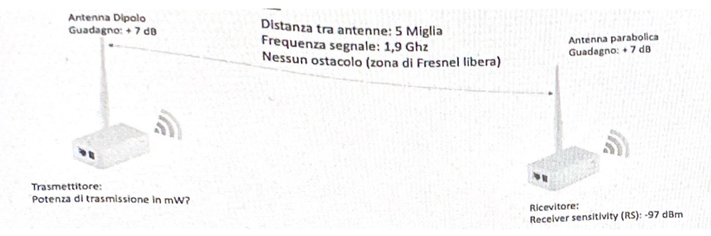

Nome e cognome:

NUMERO MATRICOLA (dispari):

### Prova Scritta del corto di Reti di Calcolateri (Computer Networks)

10 Giugno 2022

Docente: Luciano Bononi

<u>Rispondere alle domande scrivendo solo nello spazio contentito, oppure nel retro del foglio. Fornire sempre una breve motivazione o il procedimento di calcolo della tisposta, ove previsto.</u>

_(fra parentesi quadre sono indicati i punteggi, il totale è 100)_

---

1. **[8]** A quanto ammonterebbe il throughput della rete tra i nodi finali A e B se il protocollo TCP fosse Stop&Wait, con dimensione di un pacchetto segmento pari a 10KB e Round Trip Time (RTT) medio pari a 1 milliSecondo? E a quanto ammonterebbe rUtilizzo percentuale della rete?

   Se non è possibile fornire risposta spiegare perche.

---

2. **[10]** Come definireste la dimensione massima del pacchetto P in Byte che porti un router di rete R alla congestione, se il ritmo di arrivo dei pacchetti in ingresso è di 5.000 pacchetti al secondo, la capacità del canale di uscita è di 8 Mbit/s?

   P=

   ***

   Procedimento:

---

3. **[15]** Alice spedisce a Bob un messaggio **M1 molto grande** con la sola garanzia di non ripudiabilità (ovvero Alice non potrà mai dimostrare di avere spedito un messaggio diverso da quello ricevuto da Bob), ma non serve privacy (tutti possono leggere M1). Bob in seguito risponde ad Alice con un messaggio **m2 molto piccolo** del quale deve essere però data **garanzia di mittente** (solo Bob può averlo spedito), **di privacy** (nessuno oltre ad Alice può leggerlo) e **non Replay** (ovvero Alice deve accettarlo una volta sola da Bob).

   Come può essere realizzato lo schema di cifratura di costo minimo (minimo calcolo e massima efficienza) che garantisca tutti e solo i requisiti richiesti? Spiegare.

---

4. **[10]** Per ogni risposta indicare: 1) se si tratta di un indirizzo IPv4 valido, 2) di host o di rete, 3) la classe della rete Ipv4 (o che contiene l'host), 4) il numero eventuale di sottoreti identificabili dalla maschera di rete in notazione CIDR

   |                       | IPv4 valido? (si/no) | host o rete? | Classe? (A, B, C) | numero sottoreti? |
   | --------------------- | -------------------- | ------------ | ----------------- | ----------------- |
   | a) 99.99.99.99/7      |                      |              |                   |                   |
   | b) 11.111.1.11/9      |                      |              |                   |                   |
   | c) 123.123.123.321/8  |                      |              |                   |                   |
   | d) 222.222.22.192/26  |                      |              |                   |                   |
   | e) 101.0.0.101/16     |                      |              |                   |                   |
   | f) 210.210.210.120/29 |                      |              |                   |                   |
   | g) 1.1.1.1/1          |                      |              |                   |                   |
   | h) 130.136.256.254/18 |                      |              |                   |                   |
   | i) 192.0.1.0/16       |                      |              |                   |                   |
   | l) 191.0.0.0/16       |                      |              |                   |                   |

---

5. **[20]** Definire gli indirizzi IPv4 assegnabili nelle reti LOCALI sotto indicate per le esigenze definite: Usare lo spazio sul foglio per traccia procedimento e calcoli. [Define the IP addressing for the local network below. Use the back sheet for computation.]

   
   Spiegare qui sotto il procedimento [explain how you got the results here]

---

6. **[10]** Sia X l'ultima cifra (delle unità) del tuo numero di matricola, chi dovrebbe essere il router (con ultimo indirizzo IP valido) della rete che contiene 'host 131.118."1XX".O se la maschera di rete fosse 255.255.128.0?

   IPv4 del Router:

   e se la maschera di rete fosse /19?

   Fornire i Calcoli dell'esercizio 6 (altrimenti l'esercizio non viene valutato).

---

7. **[15]** Un sistema di comunicazione wireless deve supportare comunicazione su distanza di 5 miglia (1 miglio = 1.609 km) utilizando una frequenza di comunicazione di 1.9Ghz. Se le due antenne non hanno alcuna ostruzione delle zona di Fresnel e hanno entrambe un guadagno di +7 dBi, e il dispositivo ricevente ha una receiver sensitivity (RS) pari a -97 dBm,:

   

   - quale deve essere la potenza, trasmissiva del trasmettitore in mW per potere aver una comunicazione affidabile anche in una giornata di nebbia?

     Potenza del trasmettitore (in mW):

     fornire qui traccia del ragionamento e dei calcoli:

   - è possibile spostare i due dispositivi a distanza doppia mantenendo la stessa comunicazione? Spiegare.

     [ ] SI, è possibile

     [ ] NO, non è possibile

     fornire qui la motivazione della risposta:

   - A quanto ammonta la dimensione del 100% raggio della zona di fresnel in metri? (1 feet = 30,5 cm)

     Raggio zona di Fresnel in metri:

     fornire qui traccia del ragionamento e dei calcoli:

---

8. **[12]** Un segnale radio emesso alla frequenza di 37,5 MhZ percorre una distanza di 29 metri in linea retta, ma lo stesso segnale emesso percorre una litanza di 21 metri prima di rimbalzare di 90° giungendo poi al ricevitore.

   

   - La copia del segnale dopo il rimbalzo arriva al trasmettitore in anticipo o in ritardo di fase rispetto al segnale giunto in linea retta? Spiegare

   - La risultante dei due segnali ricevuti dal ricevitore (line-of-sight e a rimbalzo) consente una buona comunicazione dei dati? Motivare la risposta con i calcoli necessari.

     [ ] Si, consente ottima comunicazione

     [ ] Nè si nè no

     [ ]No, non consente buona comunicazione

   - Se la potenza di trasmissione era di 20 mW, di quanto deve essere aumentata la potenza di comunicazione per garantire sempre un'ottima comunicazione? Motivare la risposta.

     [ ] Almeno del doppio

     [ ] almeno 10 volte

     [ ] nessuna delle precedenti
