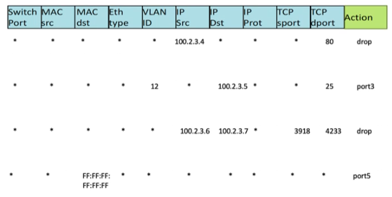
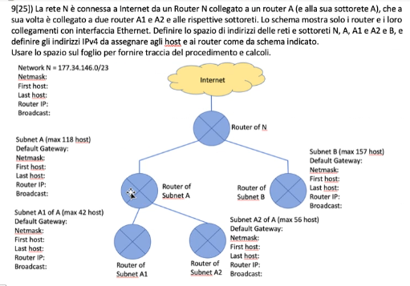

# Scritto 26 Maggio 2023
1) [5 punti] A cosa serve e come funziona il meccanismo di Fragmentation and Reassembly IPv4

2) [5 punti] Come posso riconoscere l'indirizzo IP di un server SMTP di dominio al quale spedire un messaggio di posta elettronica indirizzato a nome.cognome@dominioX.it?

3) [5 punti] A cosa servono gli indirizzi di Broadcast a livello MAC e livello Rete? Non basterebbe disporre dell'indirizzo di Broadcast solo a livello MAC o solo a livello Rete?

4) [15 punti] Alice deve spedire separatamente un messaggio m1 (breve) a Bob e un messaggio m2 (breve) a Charlie in modo che sia Bob che Charlie possano leggere m1 e m2, e poi vadano a scambiare tra loro i due messaggi m1 e m2, ma con le garanzie di confidenzialita' (trudy non legge m1 e m2), garanzia del mittente (Bob e Charlie sono certi che il messaggio proviene da Alice), integrita' (m1 e m2), garanzia del mittente (Bob e Charlie sono certi che il messaggio proviene da Alice), integrita' (m1 e m2 non sono stati modificati rispetto a queanto spedito da Alice). In che modo l'attaccante (Trudy) puo' ancora attaccare la comunicazione tra Alice e Bob? Spiegare.

5) [10 punti] Le seguenti quattro regole di tabella OpenFlow che tipo di gestione di traffico di rete SDN locale implementano sul router sul quale sono programmate?

6) [10 punti] Se un canale radio OFDM ha 18 sub-carrier e un symbol lrate di 500.000 simboli/sec quanti simboli della codifica digitale PSK deve adottare per riuscire a trasferire un file da 54 Mbit in non piu' di 4 secondi, massimizzando la resistenza all'errore di canale? Quanto tempo impiegherebbe esattamente a completare il trasferimento? (trascurare tutti gli overhead e gli errori di transmissione)

7) [5 punti] Che cosa sono le fasi di Slow Start e Congestion Avoidance del protocollo TCP e a cosa servono?

8) [10 punti] Quali dovrebbero essere gli indirizzi IPv4 di Bradcast del router (con ultimo indirizzo IP valido) della rete che contiene l'host `54.205.211.33` se la maschera di rete fosse `255.248.0.0`?
E se la maschera di rete fosse /21?

9) [25 punti] Esercizio di programmazione di rete

10) [10 punti] Un sistema di comunicazione wireless ha un dispositivo ricevente R in grado di garantire le seguenti prestazioni:

Bitrate nominale possibile | se in presenza di Link Budget minimo
:-: | :-:
1 Mbps | 5 dB
2 Mbps | 8 dB
4 Mbps | 14 dB
8 Mbps | 20 dB
16 Mbps | 26 dB
32 Mbps | 32 dB
64 Mbps | 38 dB

   1) Assumendo che l'Intentional radiator del trasmettitore T fornisca la potenza di segnale Ptx = 25mW a un'antenna con guadagno di 8 dBi e che il ricevitore abbla un'antenna omnidirezionale con guadagno di 3 dBi, e che il path loss dovuto alla distanza di un miglio sia pari a -80 dB, a quale velocità avviene la comunicazione se la Receiver Sensitivity di R è pari a -75 dBm?
   2) E se la distanza tra T e R si riducesse a 1/3 di miglio?

